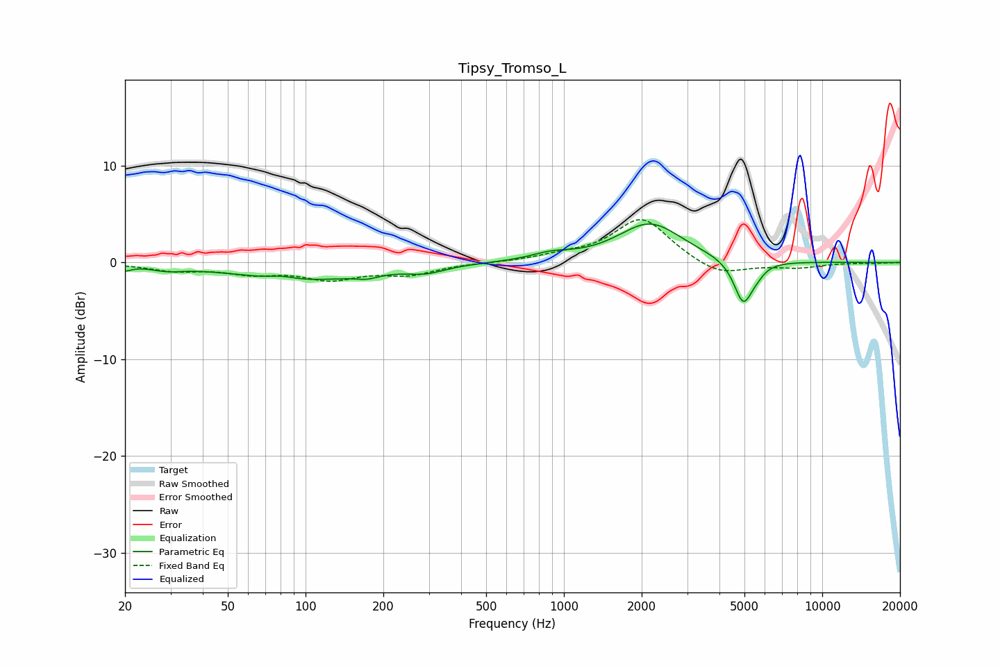

# Tipsy_Tromso_L
See [usage instructions](https://github.com/jaakkopasanen/AutoEq#usage) for more options and info.

### Parametric EQs
Apply preamp of -4.1 dB when using parametric equalizer.

|   # | Type    |   Fc (Hz) |    Q |   Gain (dB) |
|-----|---------|-----------|------|-------------|
|   1 | Peaking |        20 | 5.99 |        -0.5 |
|   2 | Peaking |        29 | 2.19 |        -0.5 |
|   3 | Peaking |        81 | 2.99 |         0.3 |
|   4 | Peaking |        97 | 0.56 |        -1.8 |
|   5 | Peaking |       173 | 3.39 |        -0.4 |
|   6 | Peaking |       292 | 1.98 |        -0.7 |
|   7 | Peaking |       892 | 1.81 |         0.7 |
|   8 | Peaking |      2154 | 1.14 |         4   |
|   9 | Peaking |      4954 | 3.78 |        -4.6 |
|  10 | Peaking |      5634 | 5.46 |        -0.5 |

### Fixed Band EQs
When using fixed band (also called graphic) equalizer, apply preamp of **-4.5 dB** (if available) and set gains manually with these parameters.

|   # | Type    |   Fc (Hz) |    Q |   Gain (dB) |
|-----|---------|-----------|------|-------------|
|   1 | Peaking |        31 | 1.41 |        -0.7 |
|   2 | Peaking |        62 | 1.41 |        -1   |
|   3 | Peaking |       125 | 1.41 |        -1.5 |
|   4 | Peaking |       250 | 1.41 |        -1.1 |
|   5 | Peaking |       500 | 1.41 |        -0   |
|   6 | Peaking |      1000 | 1.41 |         0.5 |
|   7 | Peaking |      2000 | 1.41 |         4.6 |
|   8 | Peaking |      4000 | 1.41 |        -1.5 |
|   9 | Peaking |      8000 | 1.41 |        -0.5 |
|  10 | Peaking |     16000 | 1.41 |        -0.1 |

### Graphs

