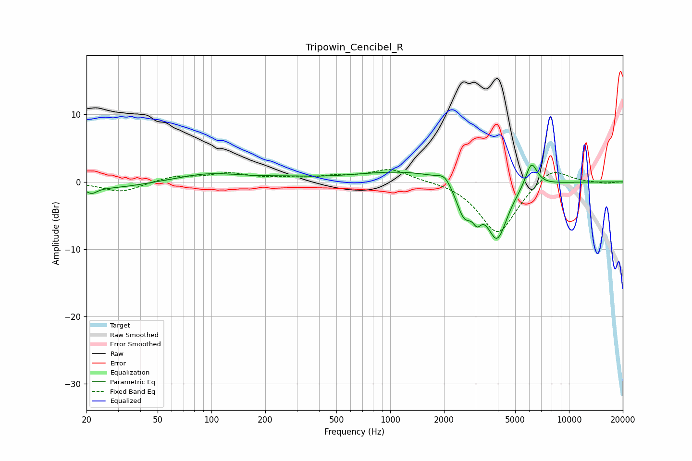

# Tripowin_Cencibel_R
See [usage instructions](https://github.com/jaakkopasanen/AutoEq#usage) for more options and info.

### Parametric EQs
Apply preamp of -2.6 dB when using parametric equalizer.

|   # | Type    |   Fc (Hz) |    Q |   Gain (dB) |
|-----|---------|-----------|------|-------------|
|   1 | Peaking |        21 | 4.68 |        -0.9 |
|   2 | Peaking |        26 | 0.66 |        -1   |
|   3 | Peaking |        97 | 0.78 |         1.2 |
|   4 | Peaking |       255 | 0.92 |         0.4 |
|   5 | Peaking |      1292 | 0.48 |         1.7 |
|   6 | Peaking |      2021 | 3.77 |         1.3 |
|   7 | Peaking |      2588 | 3.06 |        -4.7 |
|   8 | Peaking |      3063 | 5.96 |        -2.2 |
|   9 | Peaking |      3960 | 2.32 |        -8.5 |
|  10 | Peaking |      6160 | 4.17 |         3.8 |

### Fixed Band EQs
When using fixed band (also called graphic) equalizer, apply preamp of **-1.9 dB** (if available) and set gains manually with these parameters.

|   # | Type    |   Fc (Hz) |    Q |   Gain (dB) |
|-----|---------|-----------|------|-------------|
|   1 | Peaking |        31 | 1.41 |        -1.5 |
|   2 | Peaking |        62 | 1.41 |         0.8 |
|   3 | Peaking |       125 | 1.41 |         1.2 |
|   4 | Peaking |       250 | 1.41 |         0.4 |
|   5 | Peaking |       500 | 1.41 |         0.7 |
|   6 | Peaking |      1000 | 1.41 |         1.9 |
|   7 | Peaking |      2000 | 1.41 |         0.2 |
|   8 | Peaking |      4000 | 1.41 |        -7.8 |
|   9 | Peaking |      8000 | 1.41 |         2.5 |
|  10 | Peaking |     16000 | 1.41 |        -0.2 |

### Graphs

