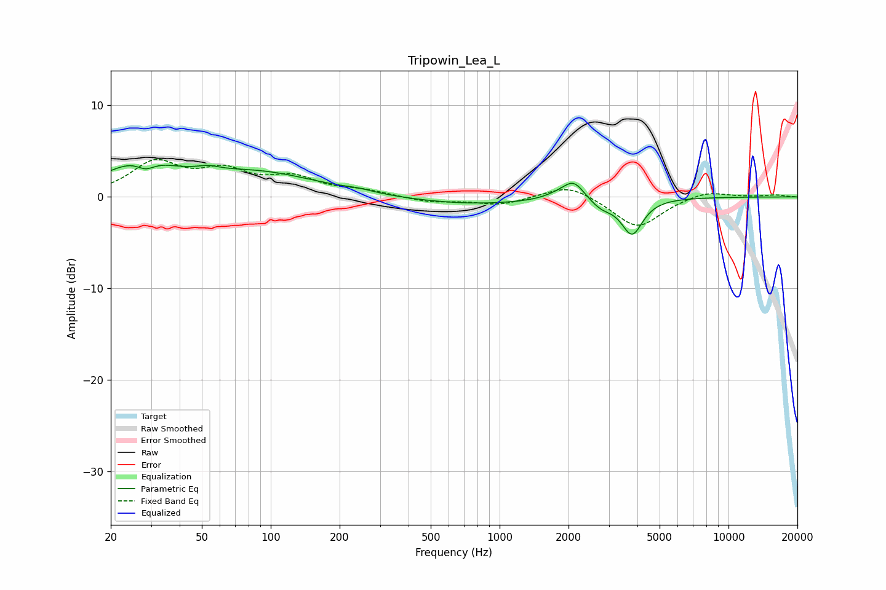

# Tripowin_Lea_L
See [usage instructions](https://github.com/jaakkopasanen/AutoEq#usage) for more options and info.

### Parametric EQs
Apply preamp of -3.6 dB when using parametric equalizer.

|   # | Type    |   Fc (Hz) |    Q |   Gain (dB) |
|-----|---------|-----------|------|-------------|
|   1 | Peaking |        27 | 0.93 |         3.3 |
|   2 | Peaking |        28 | 3.61 |        -1   |
|   3 | Peaking |        53 | 2.9  |         0.5 |
|   4 | Peaking |        88 | 0.54 |         2.5 |
|   5 | Peaking |       241 | 2.27 |         0.2 |
|   6 | Peaking |       749 | 0.51 |        -0.8 |
|   7 | Peaking |      1803 | 2.33 |         0.5 |
|   8 | Peaking |      2111 | 3.07 |         2   |
|   9 | Peaking |      2780 | 2.75 |        -1   |
|  10 | Peaking |      3791 | 3.07 |        -3.9 |

### Fixed Band EQs
When using fixed band (also called graphic) equalizer, apply preamp of **-4.2 dB** (if available) and set gains manually with these parameters.

|   # | Type    |   Fc (Hz) |    Q |   Gain (dB) |
|-----|---------|-----------|------|-------------|
|   1 | Peaking |        31 | 1.41 |         3.6 |
|   2 | Peaking |        62 | 1.41 |         2.4 |
|   3 | Peaking |       125 | 1.41 |         1.9 |
|   4 | Peaking |       250 | 1.41 |         0.6 |
|   5 | Peaking |       500 | 1.41 |        -0.6 |
|   6 | Peaking |      1000 | 1.41 |        -0.9 |
|   7 | Peaking |      2000 | 1.41 |         1.5 |
|   8 | Peaking |      4000 | 1.41 |        -3.4 |
|   9 | Peaking |      8000 | 1.41 |         0.7 |
|  10 | Peaking |     16000 | 1.41 |         0.2 |

### Graphs

