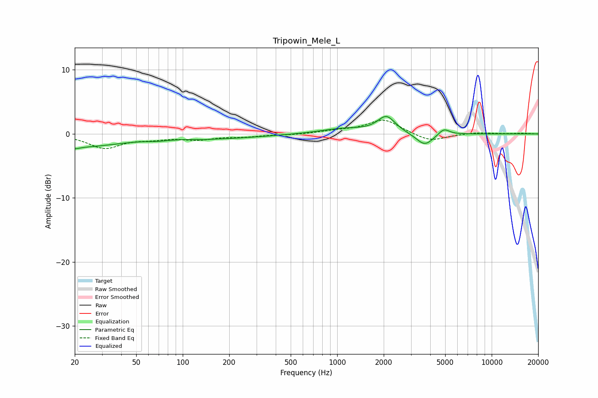

# Tripowin_Mele_L
See [usage instructions](https://github.com/jaakkopasanen/AutoEq#usage) for more options and info.

### Parametric EQs
Apply preamp of -2.8 dB when using parametric equalizer.

|   # | Type    |   Fc (Hz) |    Q |   Gain (dB) |
|-----|---------|-----------|------|-------------|
|   1 | Peaking |        20 | 0.48 |        -2   |
|   2 | Peaking |        21 | 5.88 |        -1.7 |
|   3 | Peaking |        21 | 5.98 |         1.4 |
|   4 | Peaking |        69 | 2.55 |        -0.2 |
|   5 | Peaking |       136 | 5.96 |        -0.1 |
|   6 | Peaking |       165 | 0.46 |        -0.7 |
|   7 | Peaking |      1104 | 0.92 |         0.8 |
|   8 | Peaking |      2083 | 2.5  |         2.6 |
|   9 | Peaking |      3686 | 2.52 |        -2   |
|  10 | Peaking |      4899 | 3.95 |         1   |

### Fixed Band EQs
When using fixed band (also called graphic) equalizer, apply preamp of **-2.2 dB** (if available) and set gains manually with these parameters.

|   # | Type    |   Fc (Hz) |    Q |   Gain (dB) |
|-----|---------|-----------|------|-------------|
|   1 | Peaking |        31 | 1.41 |        -2.2 |
|   2 | Peaking |        62 | 1.41 |        -0.6 |
|   3 | Peaking |       125 | 1.41 |        -0.8 |
|   4 | Peaking |       250 | 1.41 |        -0.4 |
|   5 | Peaking |       500 | 1.41 |        -0.1 |
|   6 | Peaking |      1000 | 1.41 |         0.4 |
|   7 | Peaking |      2000 | 1.41 |         2.3 |
|   8 | Peaking |      4000 | 1.41 |        -1.3 |
|   9 | Peaking |      8000 | 1.41 |         0.2 |
|  10 | Peaking |     16000 | 1.41 |         0.1 |

### Graphs

