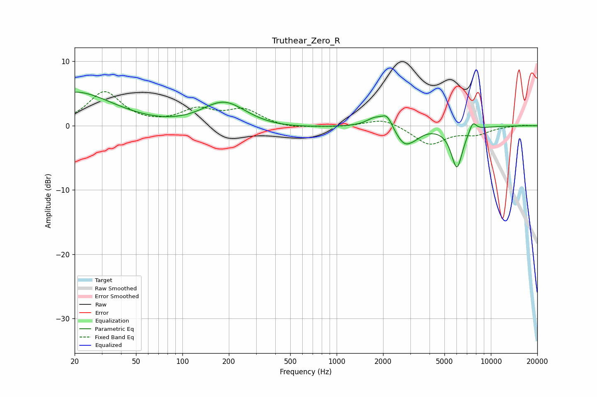

# Truthear_Zero_R
See [usage instructions](https://github.com/jaakkopasanen/AutoEq#usage) for more options and info.

### Parametric EQs
Apply preamp of -5.3 dB when using parametric equalizer.

|   # | Type    |   Fc (Hz) |    Q |   Gain (dB) |
|-----|---------|-----------|------|-------------|
|   1 | Peaking |        20 | 0.57 |         5.2 |
|   2 | Peaking |       186 | 0.93 |         4.6 |
|   3 | Peaking |       209 | 0.36 |        -1.1 |
|   4 | Peaking |      1767 | 2.54 |         1.3 |
|   5 | Peaking |      2124 | 3.99 |         2   |
|   6 | Peaking |      2551 | 1.76 |        -0.4 |
|   7 | Peaking |      2757 | 2.56 |        -2.4 |
|   8 | Peaking |      3243 | 2.86 |        -0.7 |
|   9 | Peaking |      6022 | 3.66 |        -6.4 |
|  10 | Peaking |      7633 | 5.77 |         1.6 |

### Fixed Band EQs
When using fixed band (also called graphic) equalizer, apply preamp of **-5.4 dB** (if available) and set gains manually with these parameters.

|   # | Type    |   Fc (Hz) |    Q |   Gain (dB) |
|-----|---------|-----------|------|-------------|
|   1 | Peaking |        31 | 1.41 |         5.2 |
|   2 | Peaking |        62 | 1.41 |        -0   |
|   3 | Peaking |       125 | 1.41 |         2.3 |
|   4 | Peaking |       250 | 1.41 |         2.3 |
|   5 | Peaking |       500 | 1.41 |        -0.5 |
|   6 | Peaking |      1000 | 1.41 |        -0.2 |
|   7 | Peaking |      2000 | 1.41 |         1.2 |
|   8 | Peaking |      4000 | 1.41 |        -2.9 |
|   9 | Peaking |      8000 | 1.41 |        -1.2 |
|  10 | Peaking |     16000 | 1.41 |         0.1 |

### Graphs

