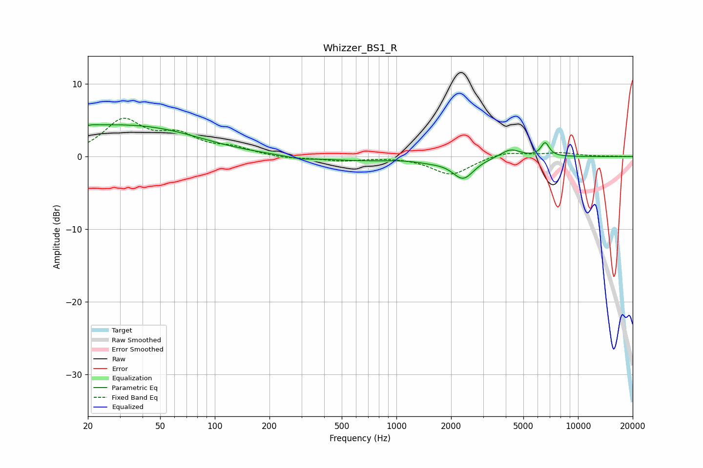

# Whizzer_BS1_R
See [usage instructions](https://github.com/jaakkopasanen/AutoEq#usage) for more options and info.

### Parametric EQs
Apply preamp of -4.5 dB when using parametric equalizer.

|   # | Type    |   Fc (Hz) |    Q |   Gain (dB) |
|-----|---------|-----------|------|-------------|
|   1 | Peaking |        20 | 5.9  |        -3.2 |
|   2 | Peaking |        20 | 5.77 |         3.3 |
|   3 | Peaking |        22 | 0.31 |         3.9 |
|   4 | Peaking |        57 | 0.57 |         1   |
|   5 | Peaking |       296 | 1.8  |        -0.4 |
|   6 | Peaking |       638 | 0.7  |        -0.5 |
|   7 | Peaking |      1542 | 1.77 |        -0.4 |
|   8 | Peaking |      2331 | 2.38 |        -2.9 |
|   9 | Peaking |      4248 | 2.6  |         1.2 |
|  10 | Peaking |      6588 | 6    |         1.9 |

### Fixed Band EQs
When using fixed band (also called graphic) equalizer, apply preamp of **-5.4 dB** (if available) and set gains manually with these parameters.

|   # | Type    |   Fc (Hz) |    Q |   Gain (dB) |
|-----|---------|-----------|------|-------------|
|   1 | Peaking |        31 | 1.41 |         4.8 |
|   2 | Peaking |        62 | 1.41 |         2.5 |
|   3 | Peaking |       125 | 1.41 |         1   |
|   4 | Peaking |       250 | 1.41 |        -0.3 |
|   5 | Peaking |       500 | 1.41 |        -0.5 |
|   6 | Peaking |      1000 | 1.41 |         0   |
|   7 | Peaking |      2000 | 1.41 |        -2.5 |
|   8 | Peaking |      4000 | 1.41 |         0.7 |
|   9 | Peaking |      8000 | 1.41 |         0.5 |
|  10 | Peaking |     16000 | 1.41 |         0   |

### Graphs

