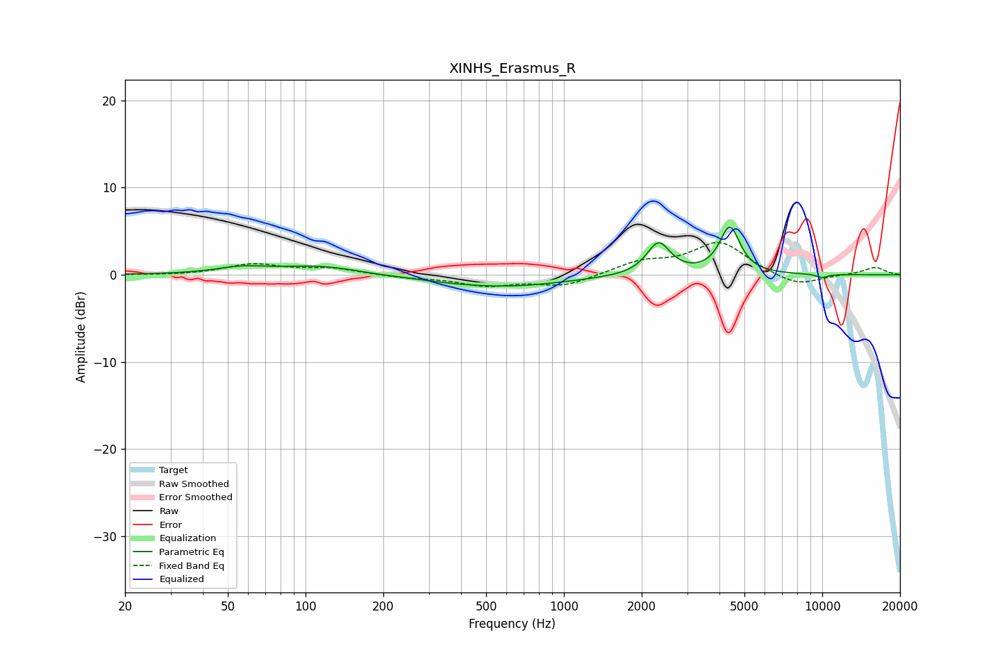

# XINHS_Erasmus_R
See [usage instructions](https://github.com/jaakkopasanen/AutoEq#usage) for more options and info.

### Parametric EQs
Apply preamp of -5.6 dB when using parametric equalizer.

|   # | Type    |   Fc (Hz) |    Q |   Gain (dB) |
|-----|---------|-----------|------|-------------|
|   1 | Peaking |        56 | 1.49 |         0.7 |
|   2 | Peaking |       113 | 0.86 |         1   |
|   3 | Peaking |       184 | 2.46 |        -0.1 |
|   4 | Peaking |       425 | 0.8  |        -0.5 |
|   5 | Peaking |       466 | 1.16 |         0.2 |
|   6 | Peaking |       614 | 0.59 |        -1.1 |
|   7 | Peaking |      1164 | 4.89 |         0   |
|   8 | Peaking |      2324 | 3.11 |         3.7 |
|   9 | Peaking |      4386 | 3.63 |         5.4 |
|  10 | Peaking |     10000 | 5.35 |        -0.4 |

### Fixed Band EQs
When using fixed band (also called graphic) equalizer, apply preamp of **-3.8 dB** (if available) and set gains manually with these parameters.

|   # | Type    |   Fc (Hz) |    Q |   Gain (dB) |
|-----|---------|-----------|------|-------------|
|   1 | Peaking |        31 | 1.41 |        -0.1 |
|   2 | Peaking |        62 | 1.41 |         1.2 |
|   3 | Peaking |       125 | 1.41 |         0.7 |
|   4 | Peaking |       250 | 1.41 |        -0.3 |
|   5 | Peaking |       500 | 1.41 |        -1.2 |
|   6 | Peaking |      1000 | 1.41 |        -1.3 |
|   7 | Peaking |      2000 | 1.41 |         1.4 |
|   8 | Peaking |      4000 | 1.41 |         3.7 |
|   9 | Peaking |      8000 | 1.41 |        -1.4 |
|  10 | Peaking |     16000 | 1.41 |         0.9 |

### Graphs

