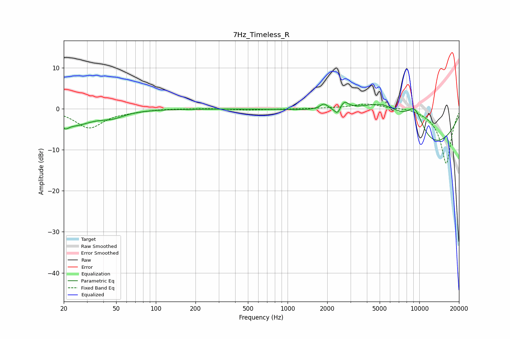

# 7Hz_Timeless_R
See [usage instructions](https://github.com/jaakkopasanen/AutoEq#usage) for more options and info.

### Parametric EQs
Apply preamp of -1.7 dB when using parametric equalizer.

|   # | Type    |   Fc (Hz) |    Q |   Gain (dB) |
|-----|---------|-----------|------|-------------|
|   1 | Peaking |        21 | 5.79 |        -1.2 |
|   2 | Peaking |        23 | 0.96 |        -3.7 |
|   3 | Peaking |        26 | 5.9  |        -0   |
|   4 | Peaking |        47 | 1.62 |        -1.3 |
|   5 | Peaking |      1886 | 4.67 |         1.4 |
|   6 | Peaking |      2397 | 6    |        -2   |
|   7 | Peaking |      2677 | 4.19 |         2.1 |
|   8 | Peaking |      5532 | 0.64 |         8.8 |
|   9 | Peaking |      9265 | 1.8  |         7   |
|  10 | Peaking |     10000 | 0.34 |       -12.4 |

### Fixed Band EQs
When using fixed band (also called graphic) equalizer, apply preamp of **-1.3 dB** (if available) and set gains manually with these parameters.

|   # | Type    |   Fc (Hz) |    Q |   Gain (dB) |
|-----|---------|-----------|------|-------------|
|   1 | Peaking |        31 | 1.41 |        -4.6 |
|   2 | Peaking |        62 | 1.41 |        -0.4 |
|   3 | Peaking |       125 | 1.41 |         0.1 |
|   4 | Peaking |       250 | 1.41 |         0.1 |
|   5 | Peaking |       500 | 1.41 |        -0.3 |
|   6 | Peaking |      1000 | 1.41 |        -0   |
|   7 | Peaking |      2000 | 1.41 |         0.1 |
|   8 | Peaking |      4000 | 1.41 |         1.3 |
|   9 | Peaking |      8000 | 1.41 |         0.5 |
|  10 | Peaking |     16000 | 1.41 |       -13.4 |

### Graphs

