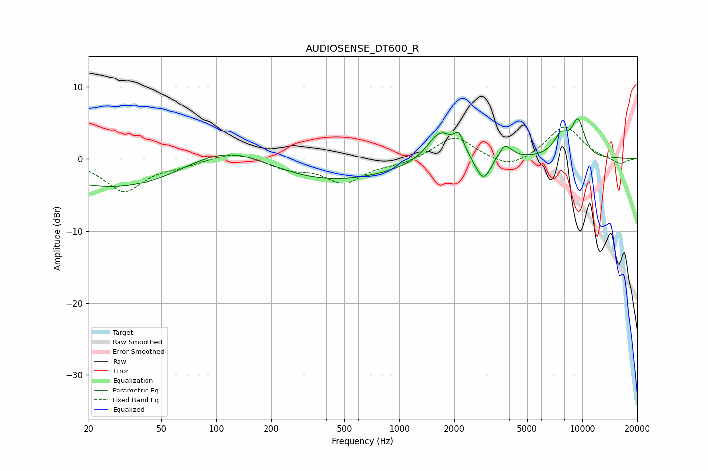

# AUDIOSENSE_DT600_R
See [usage instructions](https://github.com/jaakkopasanen/AutoEq#usage) for more options and info.

### Parametric EQs
Apply preamp of -5.7 dB when using parametric equalizer.

|   # | Type    |   Fc (Hz) |    Q |   Gain (dB) |
|-----|---------|-----------|------|-------------|
|   1 | Peaking |       103 | 0.18 |       -11.6 |
|   2 | Peaking |       114 | 0.37 |        12.1 |
|   3 | Peaking |      1644 | 2.02 |         3.8 |
|   4 | Peaking |      1756 | 3.58 |         0.5 |
|   5 | Peaking |      2121 | 5.04 |         2.7 |
|   6 | Peaking |      2895 | 3.4  |        -3.4 |
|   7 | Peaking |      3774 | 3.64 |         2.2 |
|   8 | Peaking |      7664 | 3.12 |         2.8 |
|   9 | Peaking |      9399 | 3.47 |         3.3 |
|  10 | Peaking |      9638 | 4.01 |         1.6 |

### Fixed Band EQs
When using fixed band (also called graphic) equalizer, apply preamp of **-4.5 dB** (if available) and set gains manually with these parameters.

|   # | Type    |   Fc (Hz) |    Q |   Gain (dB) |
|-----|---------|-----------|------|-------------|
|   1 | Peaking |        31 | 1.41 |        -4.5 |
|   2 | Peaking |        62 | 1.41 |        -0.7 |
|   3 | Peaking |       125 | 1.41 |         1.2 |
|   4 | Peaking |       250 | 1.41 |        -1.3 |
|   5 | Peaking |       500 | 1.41 |        -3.2 |
|   6 | Peaking |      1000 | 1.41 |        -0.7 |
|   7 | Peaking |      2000 | 1.41 |         3.2 |
|   8 | Peaking |      4000 | 1.41 |        -1.6 |
|   9 | Peaking |      8000 | 1.41 |         4.6 |
|  10 | Peaking |     16000 | 1.41 |        -0.9 |

### Graphs

