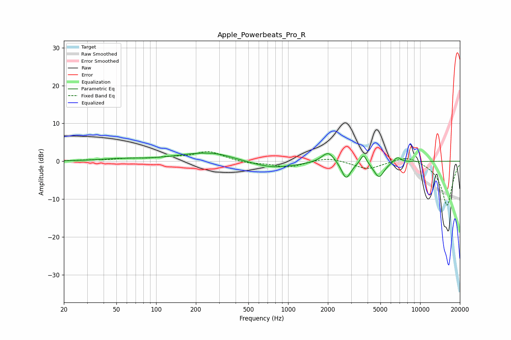

# Apple_Powerbeats_Pro_R
See [usage instructions](https://github.com/jaakkopasanen/AutoEq#usage) for more options and info.

### Parametric EQs
Apply preamp of -2.2 dB when using parametric equalizer.

|   # | Type    |   Fc (Hz) |    Q |   Gain (dB) |
|-----|---------|-----------|------|-------------|
|   1 | Peaking |        54 | 0.85 |         0.5 |
|   2 | Peaking |       229 | 0.7  |         2.2 |
|   3 | Peaking |       307 | 1.62 |         0.4 |
|   4 | Peaking |       775 | 0.85 |        -1.9 |
|   5 | Peaking |      2013 | 2.96 |         3   |
|   6 | Peaking |      2739 | 4.27 |        -3.7 |
|   7 | Peaking |      2811 | 3.26 |        -1   |
|   8 | Peaking |      3724 | 5.98 |         2.7 |
|   9 | Peaking |      4882 | 3.55 |        -4.2 |
|  10 | Peaking |      6708 | 5.03 |         1.5 |

### Fixed Band EQs
When using fixed band (also called graphic) equalizer, apply preamp of **-2.6 dB** (if available) and set gains manually with these parameters.

|   # | Type    |   Fc (Hz) |    Q |   Gain (dB) |
|-----|---------|-----------|------|-------------|
|   1 | Peaking |        31 | 1.41 |         0.2 |
|   2 | Peaking |        62 | 1.41 |         0.6 |
|   3 | Peaking |       125 | 1.41 |         0.8 |
|   4 | Peaking |       250 | 1.41 |         2.5 |
|   5 | Peaking |       500 | 1.41 |        -0.6 |
|   6 | Peaking |      1000 | 1.41 |        -1.6 |
|   7 | Peaking |      2000 | 1.41 |         1.1 |
|   8 | Peaking |      4000 | 1.41 |        -2.1 |
|   9 | Peaking |      8000 | 1.41 |         1.7 |
|  10 | Peaking |     16000 | 1.41 |       -11.8 |

### Graphs

