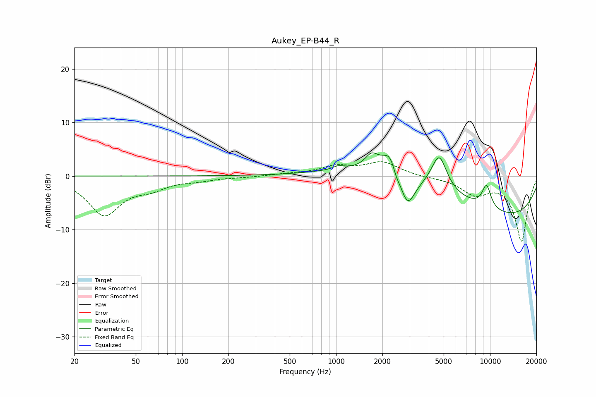

# Aukey_EP-B44_R
See [usage instructions](https://github.com/jaakkopasanen/AutoEq#usage) for more options and info.

### Parametric EQs
Apply preamp of -4.4 dB when using parametric equalizer.

|   # | Type    |   Fc (Hz) |    Q |   Gain (dB) |
|-----|---------|-----------|------|-------------|
|   1 | Peaking |      1034 | 4.1  |         0.6 |
|   2 | Peaking |      1698 | 3.4  |         2.4 |
|   3 | Peaking |      2299 | 2.88 |         2.8 |
|   4 | Peaking |      2325 | 1.94 |         2.9 |
|   5 | Peaking |      2451 | 5.56 |        -2.2 |
|   6 | Peaking |      2894 | 2.71 |        -6.9 |
|   7 | Peaking |      4130 | 0.28 |         4.5 |
|   8 | Peaking |      4670 | 2.78 |         6.6 |
|   9 | Peaking |      9481 | 4.24 |         4.3 |
|  10 | Peaking |     10000 | 0.25 |        -9.5 |

### Fixed Band EQs
When using fixed band (also called graphic) equalizer, apply preamp of **-2.8 dB** (if available) and set gains manually with these parameters.

|   # | Type    |   Fc (Hz) |    Q |   Gain (dB) |
|-----|---------|-----------|------|-------------|
|   1 | Peaking |        31 | 1.41 |        -7.1 |
|   2 | Peaking |        62 | 1.41 |        -1.8 |
|   3 | Peaking |       125 | 1.41 |        -0.6 |
|   4 | Peaking |       250 | 1.41 |        -0.2 |
|   5 | Peaking |       500 | 1.41 |         0.3 |
|   6 | Peaking |      1000 | 1.41 |         1.7 |
|   7 | Peaking |      2000 | 1.41 |         2.5 |
|   8 | Peaking |      4000 | 1.41 |        -0.2 |
|   9 | Peaking |      8000 | 1.41 |        -3.1 |
|  10 | Peaking |     16000 | 1.41 |       -12.1 |

### Graphs

