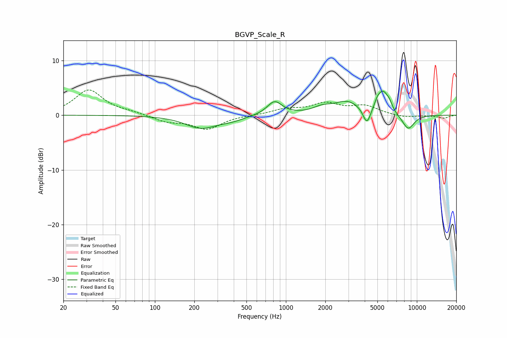

# BGVP_Scale_R
See [usage instructions](https://github.com/jaakkopasanen/AutoEq#usage) for more options and info.

### Parametric EQs
Apply preamp of -4.5 dB when using parametric equalizer.

|   # | Type    |   Fc (Hz) |    Q |   Gain (dB) |
|-----|---------|-----------|------|-------------|
|   1 | Peaking |       225 | 1.18 |        -2.3 |
|   2 | Peaking |       386 | 1.47 |        -0.7 |
|   3 | Peaking |       820 | 2.49 |         2.5 |
|   4 | Peaking |      1880 | 2.06 |         0.9 |
|   5 | Peaking |      2943 | 1.36 |         2.4 |
|   6 | Peaking |      4152 | 4.81 |        -3   |
|   7 | Peaking |      4997 | 6    |         1.2 |
|   8 | Peaking |      5526 | 3.46 |         3.7 |
|   9 | Peaking |      6171 | 6    |         1   |
|  10 | Peaking |      8583 | 2.75 |        -2.8 |

### Fixed Band EQs
When using fixed band (also called graphic) equalizer, apply preamp of **-4.7 dB** (if available) and set gains manually with these parameters.

|   # | Type    |   Fc (Hz) |    Q |   Gain (dB) |
|-----|---------|-----------|------|-------------|
|   1 | Peaking |        31 | 1.41 |         4.6 |
|   2 | Peaking |        62 | 1.41 |         0.4 |
|   3 | Peaking |       125 | 1.41 |        -1.1 |
|   4 | Peaking |       250 | 1.41 |        -2.5 |
|   5 | Peaking |       500 | 1.41 |        -0   |
|   6 | Peaking |      1000 | 1.41 |         1   |
|   7 | Peaking |      2000 | 1.41 |         2   |
|   8 | Peaking |      4000 | 1.41 |         1.6 |
|   9 | Peaking |      8000 | 1.41 |        -0.5 |
|  10 | Peaking |     16000 | 1.41 |        -0.5 |

### Graphs

