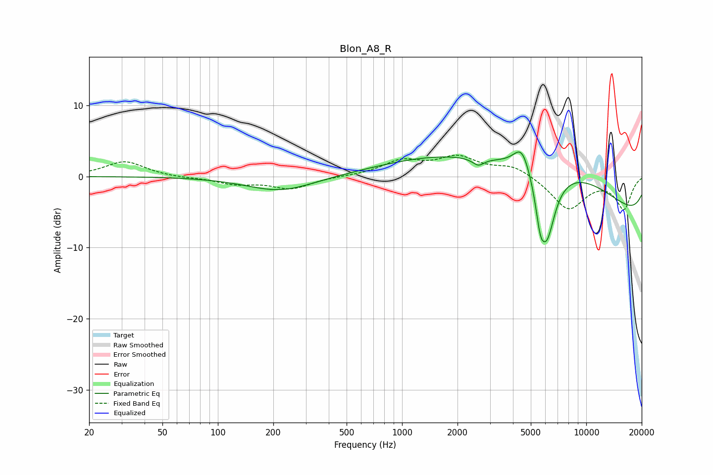

# Blon_A8_R
See [usage instructions](https://github.com/jaakkopasanen/AutoEq#usage) for more options and info.

### Parametric EQs
Apply preamp of -3.5 dB when using parametric equalizer.

|   # | Type    |   Fc (Hz) |    Q |   Gain (dB) |
|-----|---------|-----------|------|-------------|
|   1 | Peaking |       219 | 0.78 |        -2.1 |
|   2 | Peaking |      1828 | 0.4  |         3.4 |
|   3 | Peaking |      2568 | 3.11 |        -0.4 |
|   4 | Peaking |      2601 | 5.14 |        -0.7 |
|   5 | Peaking |      4467 | 3.02 |         2.8 |
|   6 | Peaking |      4514 | 3.32 |         0.7 |
|   7 | Peaking |      5626 | 5.78 |        -3.7 |
|   8 | Peaking |      6110 | 2.77 |        -9.6 |
|   9 | Peaking |      7284 | 0.32 |         9.4 |
|  10 | Peaking |     10000 | 0.18 |        -9.3 |

### Fixed Band EQs
When using fixed band (also called graphic) equalizer, apply preamp of **-3.1 dB** (if available) and set gains manually with these parameters.

|   # | Type    |   Fc (Hz) |    Q |   Gain (dB) |
|-----|---------|-----------|------|-------------|
|   1 | Peaking |        31 | 1.41 |         2.1 |
|   2 | Peaking |        62 | 1.41 |        -0.2 |
|   3 | Peaking |       125 | 1.41 |        -1   |
|   4 | Peaking |       250 | 1.41 |        -1.7 |
|   5 | Peaking |       500 | 1.41 |         0   |
|   6 | Peaking |      1000 | 1.41 |         2.1 |
|   7 | Peaking |      2000 | 1.41 |         2.5 |
|   8 | Peaking |      4000 | 1.41 |         1.5 |
|   9 | Peaking |      8000 | 1.41 |        -4.6 |
|  10 | Peaking |     16000 | 1.41 |        -4.5 |

### Graphs

