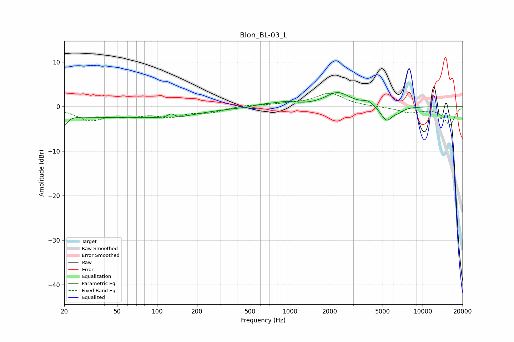

# Blon_BL-03_L
See [usage instructions](https://github.com/jaakkopasanen/AutoEq#usage) for more options and info.

### Parametric EQs
Apply preamp of -3.3 dB when using parametric equalizer.

|   # | Type    |   Fc (Hz) |    Q |   Gain (dB) |
|-----|---------|-----------|------|-------------|
|   1 | Peaking |        20 | 5.92 |        -2.2 |
|   2 | Peaking |        49 | 0.23 |        -2.4 |
|   3 | Peaking |       128 | 6    |         0.9 |
|   4 | Peaking |       139 | 1.31 |        -0.7 |
|   5 | Peaking |       640 | 1.84 |         0.5 |
|   6 | Peaking |       936 | 1.82 |         0.9 |
|   7 | Peaking |      2295 | 1.52 |         3.1 |
|   8 | Peaking |      3890 | 3.31 |         1   |
|   9 | Peaking |      5351 | 3.11 |        -3.3 |
|  10 | Peaking |      6595 | 3.74 |        -0.7 |

### Fixed Band EQs
When using fixed band (also called graphic) equalizer, apply preamp of **-3.1 dB** (if available) and set gains manually with these parameters.

|   # | Type    |   Fc (Hz) |    Q |   Gain (dB) |
|-----|---------|-----------|------|-------------|
|   1 | Peaking |        31 | 1.41 |        -2.8 |
|   2 | Peaking |        62 | 1.41 |        -1.6 |
|   3 | Peaking |       125 | 1.41 |        -1.9 |
|   4 | Peaking |       250 | 1.41 |        -1.1 |
|   5 | Peaking |       500 | 1.41 |         0.4 |
|   6 | Peaking |      1000 | 1.41 |         0.5 |
|   7 | Peaking |      2000 | 1.41 |         3   |
|   8 | Peaking |      4000 | 1.41 |        -0   |
|   9 | Peaking |      8000 | 1.41 |        -1.3 |
|  10 | Peaking |     16000 | 1.41 |        -4   |

### Graphs

