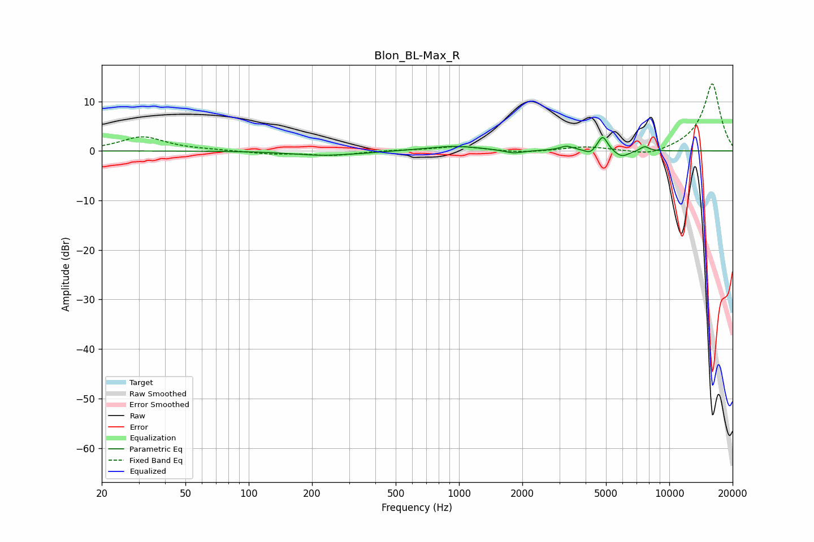

# Blon_BL-Max_R
See [usage instructions](https://github.com/jaakkopasanen/AutoEq#usage) for more options and info.

### Parametric EQs
Apply preamp of -2.8 dB when using parametric equalizer.

|   # | Type    |   Fc (Hz) |    Q |   Gain (dB) |
|-----|---------|-----------|------|-------------|
|   1 | Peaking |       223 | 1.03 |        -0.9 |
|   2 | Peaking |       354 | 1.68 |        -0.2 |
|   3 | Peaking |       949 | 1.11 |         1   |
|   4 | Peaking |      1818 | 3.17 |        -0.7 |
|   5 | Peaking |      3247 | 4.24 |         0.9 |
|   6 | Peaking |      4205 | 6    |        -0.9 |
|   7 | Peaking |      4818 | 6    |         2.6 |
|   8 | Peaking |      4829 | 5.81 |         0.6 |
|   9 | Peaking |      5930 | 3.82 |        -1.4 |
|  10 | Peaking |      7627 | 6    |         1   |

### Fixed Band EQs
When using fixed band (also called graphic) equalizer, apply preamp of **-13.6 dB** (if available) and set gains manually with these parameters.

|   # | Type    |   Fc (Hz) |    Q |   Gain (dB) |
|-----|---------|-----------|------|-------------|
|   1 | Peaking |        31 | 1.41 |         2.8 |
|   2 | Peaking |        62 | 1.41 |         0.1 |
|   3 | Peaking |       125 | 1.41 |        -0.6 |
|   4 | Peaking |       250 | 1.41 |        -0.9 |
|   5 | Peaking |       500 | 1.41 |         0.1 |
|   6 | Peaking |      1000 | 1.41 |         0.9 |
|   7 | Peaking |      2000 | 1.41 |        -0.4 |
|   8 | Peaking |      4000 | 1.41 |         0.8 |
|   9 | Peaking |      8000 | 1.41 |        -1.2 |
|  10 | Peaking |     16000 | 1.41 |        13.7 |

### Graphs

