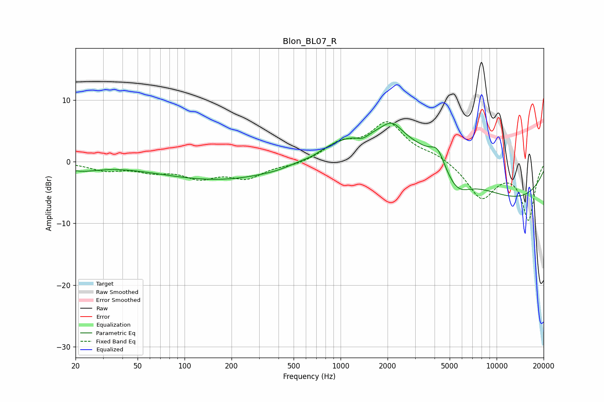

# Blon_BL07_R
See [usage instructions](https://github.com/jaakkopasanen/AutoEq#usage) for more options and info.

### Parametric EQs
Apply preamp of -6.4 dB when using parametric equalizer.

|   # | Type    |   Fc (Hz) |    Q |   Gain (dB) |
|-----|---------|-----------|------|-------------|
|   1 | Peaking |        21 | 1.18 |        -1.2 |
|   2 | Peaking |       211 | 0.3  |        -3.3 |
|   3 | Peaking |       416 | 1.29 |        -0.5 |
|   4 | Peaking |       655 | 1.88 |        -0.6 |
|   5 | Peaking |      1388 | 3.37 |        -1   |
|   6 | Peaking |      2135 | 2.31 |         2.2 |
|   7 | Peaking |      3453 | 0.19 |         8.1 |
|   8 | Peaking |      4188 | 3.19 |         2.6 |
|   9 | Peaking |      5539 | 1.53 |        -4   |
|  10 | Peaking |     10000 | 0.3  |       -10.4 |

### Fixed Band EQs
When using fixed band (also called graphic) equalizer, apply preamp of **-6.6 dB** (if available) and set gains manually with these parameters.

|   # | Type    |   Fc (Hz) |    Q |   Gain (dB) |
|-----|---------|-----------|------|-------------|
|   1 | Peaking |        31 | 1.41 |        -1.3 |
|   2 | Peaking |        62 | 1.41 |        -1.3 |
|   3 | Peaking |       125 | 1.41 |        -2.3 |
|   4 | Peaking |       250 | 1.41 |        -2.4 |
|   5 | Peaking |       500 | 1.41 |        -0.6 |
|   6 | Peaking |      1000 | 1.41 |         2.6 |
|   7 | Peaking |      2000 | 1.41 |         6.1 |
|   8 | Peaking |      4000 | 1.41 |         1   |
|   9 | Peaking |      8000 | 1.41 |        -5.8 |
|  10 | Peaking |     16000 | 1.41 |        -9.3 |

### Graphs

