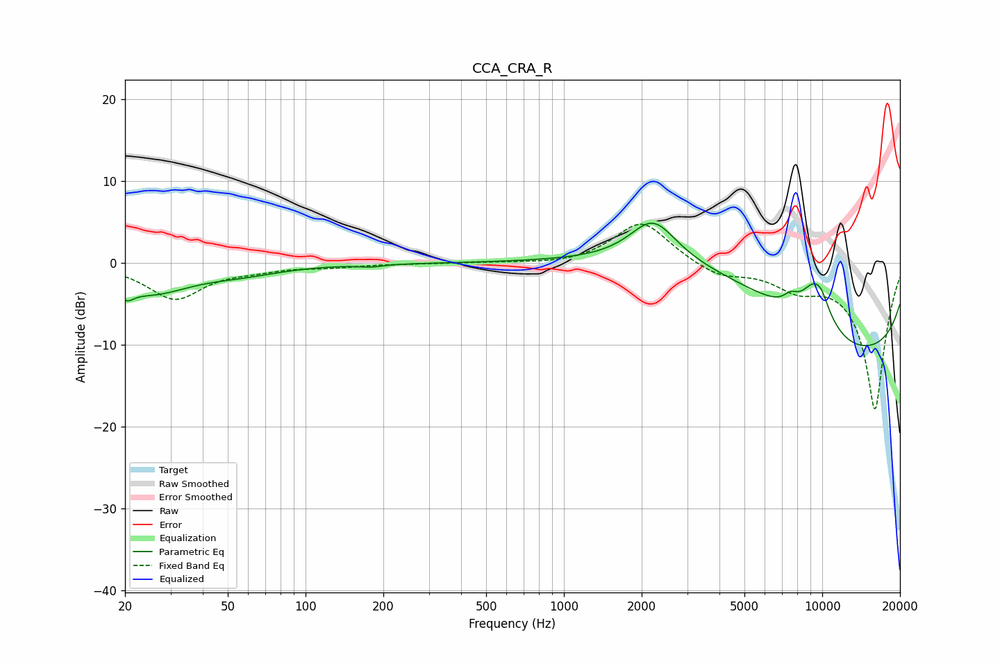

# CCA_CRA_R
See [usage instructions](https://github.com/jaakkopasanen/AutoEq#usage) for more options and info.

### Parametric EQs
Apply preamp of -5.0 dB when using parametric equalizer.

|   # | Type    |   Fc (Hz) |    Q |   Gain (dB) |
|-----|---------|-----------|------|-------------|
|   1 | Peaking |        20 | 5.13 |        -1.4 |
|   2 | Peaking |        25 | 0.92 |        -3.4 |
|   3 | Peaking |        57 | 0.9  |        -0.9 |
|   4 | Peaking |       179 | 3.27 |        -0.3 |
|   5 | Peaking |      2216 | 1.56 |         5.3 |
|   6 | Peaking |      5115 | 0.28 |        11.1 |
|   7 | Peaking |      7547 | 4.75 |         1.1 |
|   8 | Peaking |      9407 | 2.06 |         6   |
|   9 | Peaking |      9611 | 0.21 |       -18.1 |
|  10 | Peaking |      9979 | 5.47 |         0.7 |

### Fixed Band EQs
When using fixed band (also called graphic) equalizer, apply preamp of **-4.9 dB** (if available) and set gains manually with these parameters.

|   # | Type    |   Fc (Hz) |    Q |   Gain (dB) |
|-----|---------|-----------|------|-------------|
|   1 | Peaking |        31 | 1.41 |        -4.3 |
|   2 | Peaking |        62 | 1.41 |        -0.6 |
|   3 | Peaking |       125 | 1.41 |        -0.4 |
|   4 | Peaking |       250 | 1.41 |        -0   |
|   5 | Peaking |       500 | 1.41 |         0.1 |
|   6 | Peaking |      1000 | 1.41 |        -0.3 |
|   7 | Peaking |      2000 | 1.41 |         5.2 |
|   8 | Peaking |      4000 | 1.41 |        -1.6 |
|   9 | Peaking |      8000 | 1.41 |        -2.4 |
|  10 | Peaking |     16000 | 1.41 |       -17.8 |

### Graphs

