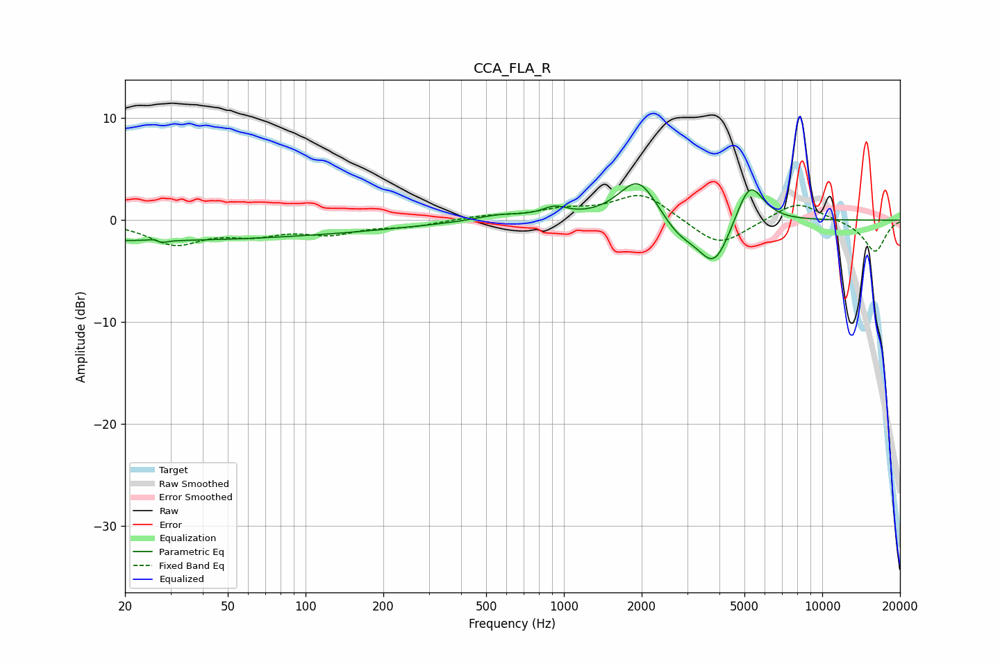

# CCA_FLA_R
See [usage instructions](https://github.com/jaakkopasanen/AutoEq#usage) for more options and info.

### Parametric EQs
Apply preamp of -3.7 dB when using parametric equalizer.

|   # | Type    |   Fc (Hz) |    Q |   Gain (dB) |
|-----|---------|-----------|------|-------------|
|   1 | Peaking |        20 | 0.2  |        -2   |
|   2 | Peaking |        27 | 5.98 |         1.9 |
|   3 | Peaking |        27 | 5.99 |        -2   |
|   4 | Peaking |       159 | 0.48 |        -0.6 |
|   5 | Peaking |       568 | 1.49 |         0.6 |
|   6 | Peaking |       922 | 2.8  |         1   |
|   7 | Peaking |      1945 | 1.85 |         4.4 |
|   8 | Peaking |      2786 | 1.86 |        -1.8 |
|   9 | Peaking |      3826 | 2.25 |        -4.6 |
|  10 | Peaking |      5233 | 2.6  |         4.3 |

### Fixed Band EQs
When using fixed band (also called graphic) equalizer, apply preamp of **-2.5 dB** (if available) and set gains manually with these parameters.

|   # | Type    |   Fc (Hz) |    Q |   Gain (dB) |
|-----|---------|-----------|------|-------------|
|   1 | Peaking |        31 | 1.41 |        -2.2 |
|   2 | Peaking |        62 | 1.41 |        -1.2 |
|   3 | Peaking |       125 | 1.41 |        -1.2 |
|   4 | Peaking |       250 | 1.41 |        -0.5 |
|   5 | Peaking |       500 | 1.41 |         0.4 |
|   6 | Peaking |      1000 | 1.41 |         0.9 |
|   7 | Peaking |      2000 | 1.41 |         2.6 |
|   8 | Peaking |      4000 | 1.41 |        -2.7 |
|   9 | Peaking |      8000 | 1.41 |         1.9 |
|  10 | Peaking |     16000 | 1.41 |        -3.1 |

### Graphs

