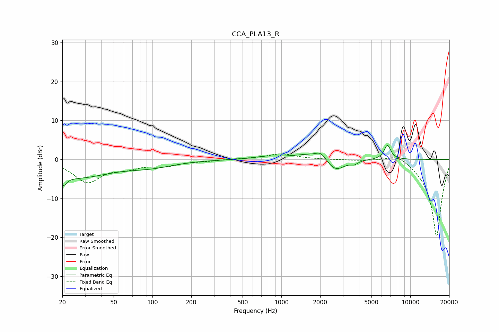

# CCA_PLA13_R
See [usage instructions](https://github.com/jaakkopasanen/AutoEq#usage) for more options and info.

### Parametric EQs
Apply preamp of -3.7 dB when using parametric equalizer.

|   # | Type    |   Fc (Hz) |    Q |   Gain (dB) |
|-----|---------|-----------|------|-------------|
|   1 | Peaking |        20 | 6    |         3.6 |
|   2 | Peaking |        20 | 5.97 |        -5.8 |
|   3 | Peaking |        25 | 0.53 |        -4.5 |
|   4 | Peaking |        98 | 0.79 |        -1.5 |
|   5 | Peaking |       756 | 1.61 |         0.6 |
|   6 | Peaking |      1690 | 1.02 |         1.5 |
|   7 | Peaking |      2024 | 3.71 |         1.6 |
|   8 | Peaking |      2631 | 2.05 |        -3.4 |
|   9 | Peaking |      3670 | 5.03 |        -0.8 |
|  10 | Peaking |      6645 | 5.2  |         3.7 |

### Fixed Band EQs
When using fixed band (also called graphic) equalizer, apply preamp of **-1.5 dB** (if available) and set gains manually with these parameters.

|   # | Type    |   Fc (Hz) |    Q |   Gain (dB) |
|-----|---------|-----------|------|-------------|
|   1 | Peaking |        31 | 1.41 |        -5.6 |
|   2 | Peaking |        62 | 1.41 |        -1.7 |
|   3 | Peaking |       125 | 1.41 |        -1.4 |
|   4 | Peaking |       250 | 1.41 |        -0.3 |
|   5 | Peaking |       500 | 1.41 |         0.2 |
|   6 | Peaking |      1000 | 1.41 |         1.4 |
|   7 | Peaking |      2000 | 1.41 |         0   |
|   8 | Peaking |      4000 | 1.41 |        -0.2 |
|   9 | Peaking |      8000 | 1.41 |         2.1 |
|  10 | Peaking |     16000 | 1.41 |       -20   |

### Graphs

