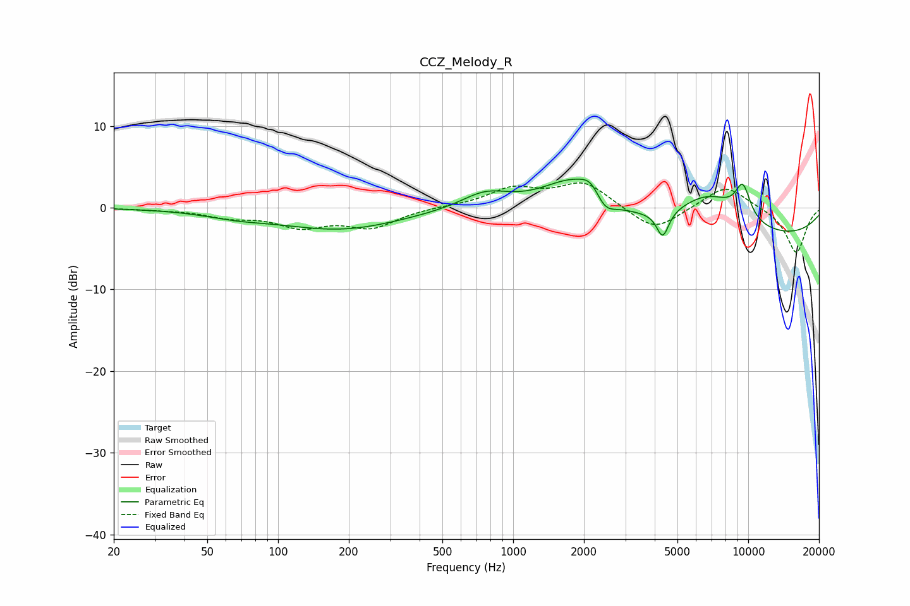

# CCZ_Melody_R
See [usage instructions](https://github.com/jaakkopasanen/AutoEq#usage) for more options and info.

### Parametric EQs
Apply preamp of -3.6 dB when using parametric equalizer.

|   # | Type    |   Fc (Hz) |    Q |   Gain (dB) |
|-----|---------|-----------|------|-------------|
|   1 | Peaking |        66 | 1    |        -0.7 |
|   2 | Peaking |       185 | 0.54 |        -2.6 |
|   3 | Peaking |       762 | 1.37 |         2   |
|   4 | Peaking |      1828 | 1.02 |         4.6 |
|   5 | Peaking |      2147 | 3.44 |         1.6 |
|   6 | Peaking |      2446 | 3.11 |        -2.1 |
|   7 | Peaking |      4329 | 5.55 |        -3.2 |
|   8 | Peaking |      6764 | 0.94 |         4.8 |
|   9 | Peaking |      8901 | 0.2  |        -4.1 |
|  10 | Peaking |      9486 | 3.83 |         4   |

### Fixed Band EQs
When using fixed band (also called graphic) equalizer, apply preamp of **-3.1 dB** (if available) and set gains manually with these parameters.

|   # | Type    |   Fc (Hz) |    Q |   Gain (dB) |
|-----|---------|-----------|------|-------------|
|   1 | Peaking |        31 | 1.41 |        -0.2 |
|   2 | Peaking |        62 | 1.41 |        -1   |
|   3 | Peaking |       125 | 1.41 |        -2.1 |
|   4 | Peaking |       250 | 1.41 |        -2.3 |
|   5 | Peaking |       500 | 1.41 |         0.1 |
|   6 | Peaking |      1000 | 1.41 |         2.2 |
|   7 | Peaking |      2000 | 1.41 |         3   |
|   8 | Peaking |      4000 | 1.41 |        -3   |
|   9 | Peaking |      8000 | 1.41 |         2.9 |
|  10 | Peaking |     16000 | 1.41 |        -5.6 |

### Graphs

