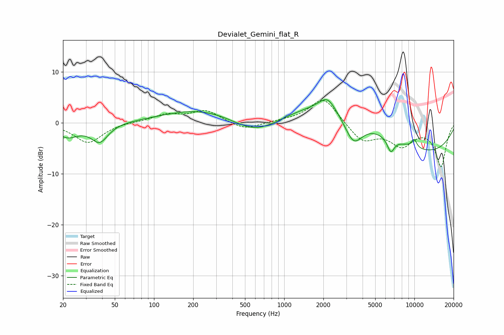

# Devialet_Gemini_flat_R
See [usage instructions](https://github.com/jaakkopasanen/AutoEq#usage) for more options and info.

### Parametric EQs
Apply preamp of -4.6 dB when using parametric equalizer.

|   # | Type    |   Fc (Hz) |    Q |   Gain (dB) |
|-----|---------|-----------|------|-------------|
|   1 | Peaking |        22 | 1.63 |        -2.6 |
|   2 | Peaking |        38 | 2.2  |        -3.6 |
|   3 | Peaking |       244 | 0.47 |         2.9 |
|   4 | Peaking |       602 | 0.75 |        -3.7 |
|   5 | Peaking |      2147 | 2.3  |         2.7 |
|   6 | Peaking |      2872 | 0.36 |         6   |
|   7 | Peaking |      3403 | 1.95 |        -5.6 |
|   8 | Peaking |      6589 | 4.89 |        -2.8 |
|   9 | Peaking |      9857 | 0.27 |        -6.7 |
|  10 | Peaking |      9956 | 5.76 |         1.7 |

### Fixed Band EQs
When using fixed band (also called graphic) equalizer, apply preamp of **-4.5 dB** (if available) and set gains manually with these parameters.

|   # | Type    |   Fc (Hz) |    Q |   Gain (dB) |
|-----|---------|-----------|------|-------------|
|   1 | Peaking |        31 | 1.41 |        -3.9 |
|   2 | Peaking |        62 | 1.41 |         0.2 |
|   3 | Peaking |       125 | 1.41 |         1.5 |
|   4 | Peaking |       250 | 1.41 |         2.4 |
|   5 | Peaking |       500 | 1.41 |        -1.5 |
|   6 | Peaking |      1000 | 1.41 |         0.3 |
|   7 | Peaking |      2000 | 1.41 |         5.1 |
|   8 | Peaking |      4000 | 1.41 |        -3.6 |
|   9 | Peaking |      8000 | 1.41 |        -4   |
|  10 | Peaking |     16000 | 1.41 |        -8.4 |

### Graphs

