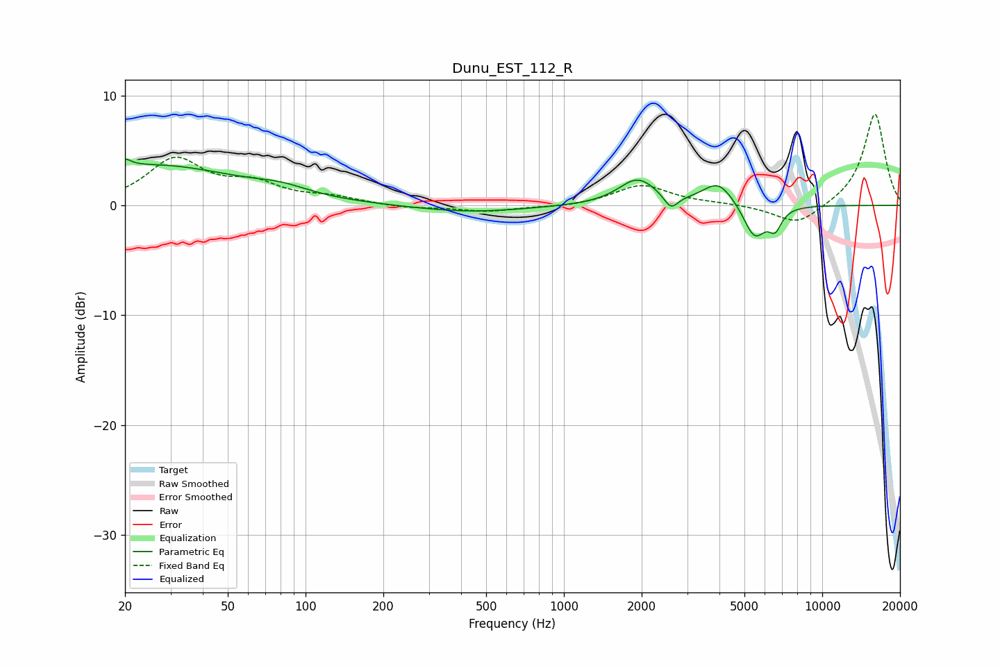

# Dunu_EST_112_R
See [usage instructions](https://github.com/jaakkopasanen/AutoEq#usage) for more options and info.

### Parametric EQs
Apply preamp of -4.3 dB when using parametric equalizer.

|   # | Type    |   Fc (Hz) |    Q |   Gain (dB) |
|-----|---------|-----------|------|-------------|
|   1 | Peaking |        20 | 5.96 |         3.2 |
|   2 | Peaking |        20 | 5.99 |        -2.5 |
|   3 | Peaking |        25 | 0.42 |         3.6 |
|   4 | Peaking |        80 | 1.35 |         0.7 |
|   5 | Peaking |       436 | 0.67 |        -0.6 |
|   6 | Peaking |      1930 | 1.92 |         2.4 |
|   7 | Peaking |      2597 | 5.18 |        -1.3 |
|   8 | Peaking |      3965 | 2.32 |         2.1 |
|   9 | Peaking |      5472 | 3.23 |        -3.1 |
|  10 | Peaking |      6576 | 5.47 |        -1.7 |

### Fixed Band EQs
When using fixed band (also called graphic) equalizer, apply preamp of **-8.4 dB** (if available) and set gains manually with these parameters.

|   # | Type    |   Fc (Hz) |    Q |   Gain (dB) |
|-----|---------|-----------|------|-------------|
|   1 | Peaking |        31 | 1.41 |         4.1 |
|   2 | Peaking |        62 | 1.41 |         1.7 |
|   3 | Peaking |       125 | 1.41 |         0.6 |
|   4 | Peaking |       250 | 1.41 |        -0.3 |
|   5 | Peaking |       500 | 1.41 |        -0.6 |
|   6 | Peaking |      1000 | 1.41 |        -0.2 |
|   7 | Peaking |      2000 | 1.41 |         1.9 |
|   8 | Peaking |      4000 | 1.41 |         0.1 |
|   9 | Peaking |      8000 | 1.41 |        -1.9 |
|  10 | Peaking |     16000 | 1.41 |         8.4 |

### Graphs

