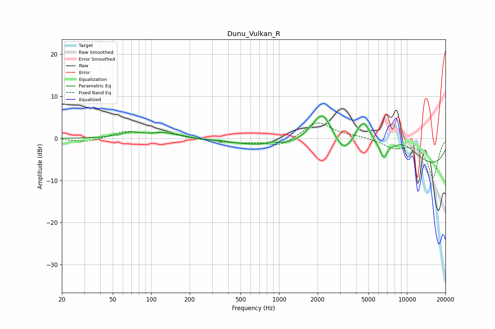

# Dunu_Vulkan_R
See [usage instructions](https://github.com/jaakkopasanen/AutoEq#usage) for more options and info.

### Parametric EQs
Apply preamp of -5.4 dB when using parametric equalizer.

|   # | Type    |   Fc (Hz) |    Q |   Gain (dB) |
|-----|---------|-----------|------|-------------|
|   1 | Peaking |        68 | 1.85 |         1.2 |
|   2 | Peaking |       129 | 1.17 |         1.4 |
|   3 | Peaking |       788 | 0.48 |        -1.4 |
|   4 | Peaking |       876 | 3.91 |         0.6 |
|   5 | Peaking |      2182 | 1.5  |         9.6 |
|   6 | Peaking |      3197 | 2.03 |        -3.4 |
|   7 | Peaking |      4540 | 1.93 |         8.5 |
|   8 | Peaking |      6538 | 5.18 |        -3   |
|   9 | Peaking |      9253 | 0.9  |         5.6 |
|  10 | Peaking |     10000 | 0.18 |        -7.8 |

### Fixed Band EQs
When using fixed band (also called graphic) equalizer, apply preamp of **-3.7 dB** (if available) and set gains manually with these parameters.

|   # | Type    |   Fc (Hz) |    Q |   Gain (dB) |
|-----|---------|-----------|------|-------------|
|   1 | Peaking |        31 | 1.41 |        -1   |
|   2 | Peaking |        62 | 1.41 |         1.6 |
|   3 | Peaking |       125 | 1.41 |         1.2 |
|   4 | Peaking |       250 | 1.41 |        -0.3 |
|   5 | Peaking |       500 | 1.41 |        -0.9 |
|   6 | Peaking |      1000 | 1.41 |        -2   |
|   7 | Peaking |      2000 | 1.41 |         4   |
|   8 | Peaking |      4000 | 1.41 |         0.5 |
|   9 | Peaking |      8000 | 1.41 |        -2.1 |
|  10 | Peaking |     16000 | 1.41 |        -9.2 |

### Graphs

