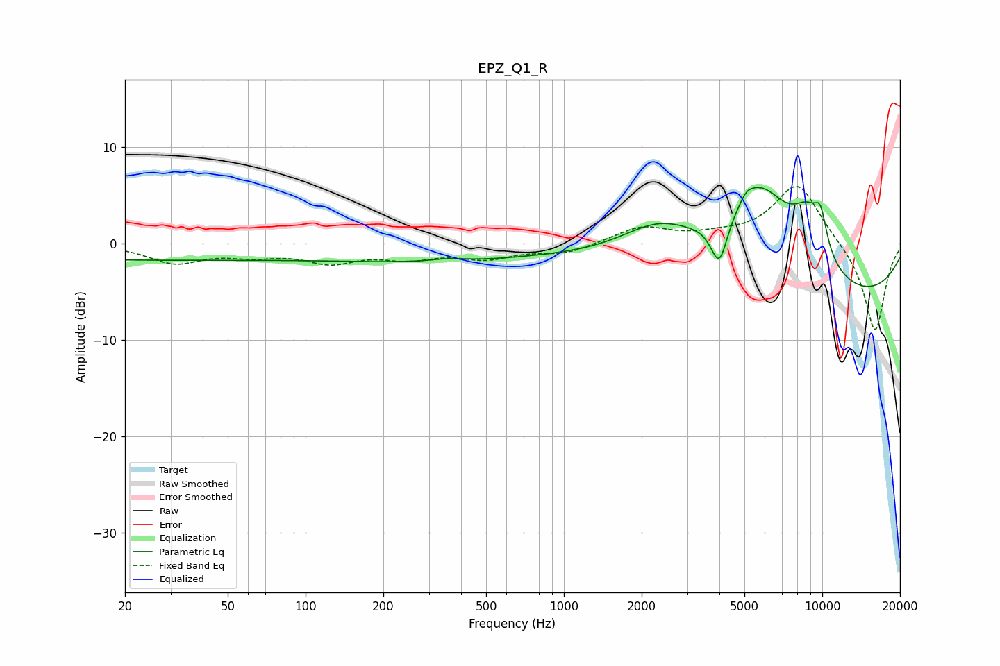

# EPZ_Q1_R
See [usage instructions](https://github.com/jaakkopasanen/AutoEq#usage) for more options and info.

### Parametric EQs
Apply preamp of -5.9 dB when using parametric equalizer.

|   # | Type    |   Fc (Hz) |    Q |   Gain (dB) |
|-----|---------|-----------|------|-------------|
|   1 | Peaking |        20 | 0.18 |        -1.7 |
|   2 | Peaking |       318 | 0.34 |        -1.7 |
|   3 | Peaking |       354 | 2.26 |         0.3 |
|   4 | Peaking |      2332 | 0.92 |         4   |
|   5 | Peaking |      3995 | 4.31 |        -4.8 |
|   6 | Peaking |      5095 | 5.91 |         0.6 |
|   7 | Peaking |      5685 | 0.94 |        10.8 |
|   8 | Peaking |      8805 | 2.05 |         4.6 |
|   9 | Peaking |      8831 | 0.2  |        -6.8 |
|  10 | Peaking |      9857 | 4.97 |         3.3 |

### Fixed Band EQs
When using fixed band (also called graphic) equalizer, apply preamp of **-6.0 dB** (if available) and set gains manually with these parameters.

|   # | Type    |   Fc (Hz) |    Q |   Gain (dB) |
|-----|---------|-----------|------|-------------|
|   1 | Peaking |        31 | 1.41 |        -1.9 |
|   2 | Peaking |        62 | 1.41 |        -1   |
|   3 | Peaking |       125 | 1.41 |        -1.7 |
|   4 | Peaking |       250 | 1.41 |        -1.3 |
|   5 | Peaking |       500 | 1.41 |        -1.3 |
|   6 | Peaking |      1000 | 1.41 |        -1   |
|   7 | Peaking |      2000 | 1.41 |         1.7 |
|   8 | Peaking |      4000 | 1.41 |         0.6 |
|   9 | Peaking |      8000 | 1.41 |         6.3 |
|  10 | Peaking |     16000 | 1.41 |        -9.3 |

### Graphs

