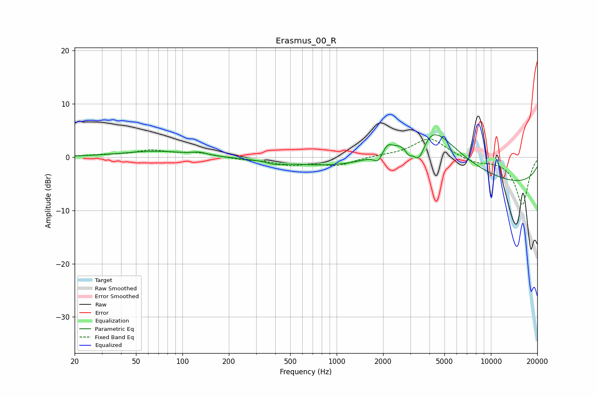

# Erasmus_00_R
See [usage instructions](https://github.com/jaakkopasanen/AutoEq#usage) for more options and info.

### Parametric EQs
Apply preamp of -4.3 dB when using parametric equalizer.

|   # | Type    |   Fc (Hz) |    Q |   Gain (dB) |
|-----|---------|-----------|------|-------------|
|   1 | Peaking |        67 | 0.65 |         1.1 |
|   2 | Peaking |       129 | 3.28 |         0.5 |
|   3 | Peaking |       399 | 2.87 |        -0.5 |
|   4 | Peaking |      1418 | 0.33 |        -2.5 |
|   5 | Peaking |      1860 | 5.15 |        -1.7 |
|   6 | Peaking |      2128 | 5.01 |         1.4 |
|   7 | Peaking |      2925 | 5.74 |        -1.7 |
|   8 | Peaking |      3413 | 2.97 |        -6.7 |
|   9 | Peaking |      3731 | 0.73 |        13.3 |
|  10 | Peaking |      9765 | 0.18 |        -5.6 |

### Fixed Band EQs
When using fixed band (also called graphic) equalizer, apply preamp of **-3.5 dB** (if available) and set gains manually with these parameters.

|   # | Type    |   Fc (Hz) |    Q |   Gain (dB) |
|-----|---------|-----------|------|-------------|
|   1 | Peaking |        31 | 1.41 |         0.3 |
|   2 | Peaking |        62 | 1.41 |         1.2 |
|   3 | Peaking |       125 | 1.41 |         0.8 |
|   4 | Peaking |       250 | 1.41 |        -0.4 |
|   5 | Peaking |       500 | 1.41 |        -1.3 |
|   6 | Peaking |      1000 | 1.41 |        -1.5 |
|   7 | Peaking |      2000 | 1.41 |         0.2 |
|   8 | Peaking |      4000 | 1.41 |         3.7 |
|   9 | Peaking |      8000 | 1.41 |        -1   |
|  10 | Peaking |     16000 | 1.41 |        -8.9 |

### Graphs

