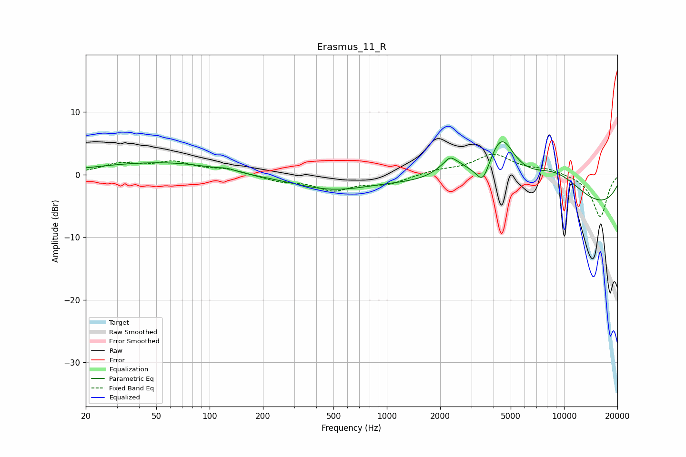

# Erasmus_11_R
See [usage instructions](https://github.com/jaakkopasanen/AutoEq#usage) for more options and info.

### Parametric EQs
Apply preamp of -5.3 dB when using parametric equalizer.

|   # | Type    |   Fc (Hz) |    Q |   Gain (dB) |
|-----|---------|-----------|------|-------------|
|   1 | Peaking |        43 | 0.45 |         1.6 |
|   2 | Peaking |        78 | 0.78 |         0.5 |
|   3 | Peaking |       126 | 3.12 |         0.4 |
|   4 | Peaking |       489 | 0.63 |        -2.3 |
|   5 | Peaking |      2265 | 5.86 |         0.7 |
|   6 | Peaking |      2340 | 1.63 |         3.7 |
|   7 | Peaking |      3490 | 4.03 |        -3   |
|   8 | Peaking |      4425 | 1.76 |         8.2 |
|   9 | Peaking |      8802 | 0.68 |         6.3 |
|  10 | Peaking |     10000 | 0.21 |        -6.9 |

### Fixed Band EQs
When using fixed band (also called graphic) equalizer, apply preamp of **-3.3 dB** (if available) and set gains manually with these parameters.

|   # | Type    |   Fc (Hz) |    Q |   Gain (dB) |
|-----|---------|-----------|------|-------------|
|   1 | Peaking |        31 | 1.41 |         1.6 |
|   2 | Peaking |        62 | 1.41 |         1.8 |
|   3 | Peaking |       125 | 1.41 |         0.8 |
|   4 | Peaking |       250 | 1.41 |        -0.9 |
|   5 | Peaking |       500 | 1.41 |        -2.3 |
|   6 | Peaking |      1000 | 1.41 |        -1.4 |
|   7 | Peaking |      2000 | 1.41 |         0.6 |
|   8 | Peaking |      4000 | 1.41 |         3.2 |
|   9 | Peaking |      8000 | 1.41 |         0.8 |
|  10 | Peaking |     16000 | 1.41 |        -6.8 |

### Graphs

