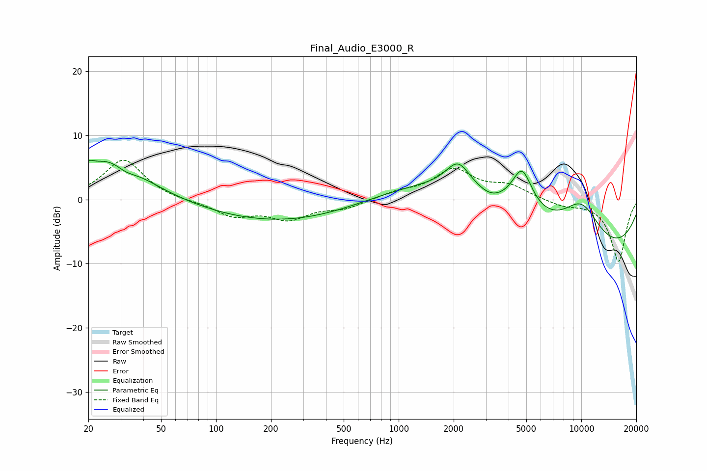

# Final_Audio_E3000_R
See [usage instructions](https://github.com/jaakkopasanen/AutoEq#usage) for more options and info.

### Parametric EQs
Apply preamp of -6.2 dB when using parametric equalizer.

|   # | Type    |   Fc (Hz) |    Q |   Gain (dB) |
|-----|---------|-----------|------|-------------|
|   1 | Peaking |        20 | 6    |         0.9 |
|   2 | Peaking |        27 | 0.79 |         6.8 |
|   3 | Peaking |        32 | 2.31 |        -1.4 |
|   4 | Peaking |       233 | 0.33 |        -3.6 |
|   5 | Peaking |      2116 | 2.12 |         4.2 |
|   6 | Peaking |      2500 | 0.33 |         7.2 |
|   7 | Peaking |      3184 | 2.25 |        -0.7 |
|   8 | Peaking |      4734 | 2.44 |         6.6 |
|   9 | Peaking |      8576 | 0.2  |       -10.2 |
|  10 | Peaking |     10000 | 1.07 |         6.9 |

### Fixed Band EQs
When using fixed band (also called graphic) equalizer, apply preamp of **-6.2 dB** (if available) and set gains manually with these parameters.

|   # | Type    |   Fc (Hz) |    Q |   Gain (dB) |
|-----|---------|-----------|------|-------------|
|   1 | Peaking |        31 | 1.41 |         6.3 |
|   2 | Peaking |        62 | 1.41 |        -0.3 |
|   3 | Peaking |       125 | 1.41 |        -2.4 |
|   4 | Peaking |       250 | 1.41 |        -2.8 |
|   5 | Peaking |       500 | 1.41 |        -1.3 |
|   6 | Peaking |      1000 | 1.41 |         1   |
|   7 | Peaking |      2000 | 1.41 |         4.5 |
|   8 | Peaking |      4000 | 1.41 |         1.9 |
|   9 | Peaking |      8000 | 1.41 |        -0.9 |
|  10 | Peaking |     16000 | 1.41 |        -9.7 |

### Graphs

