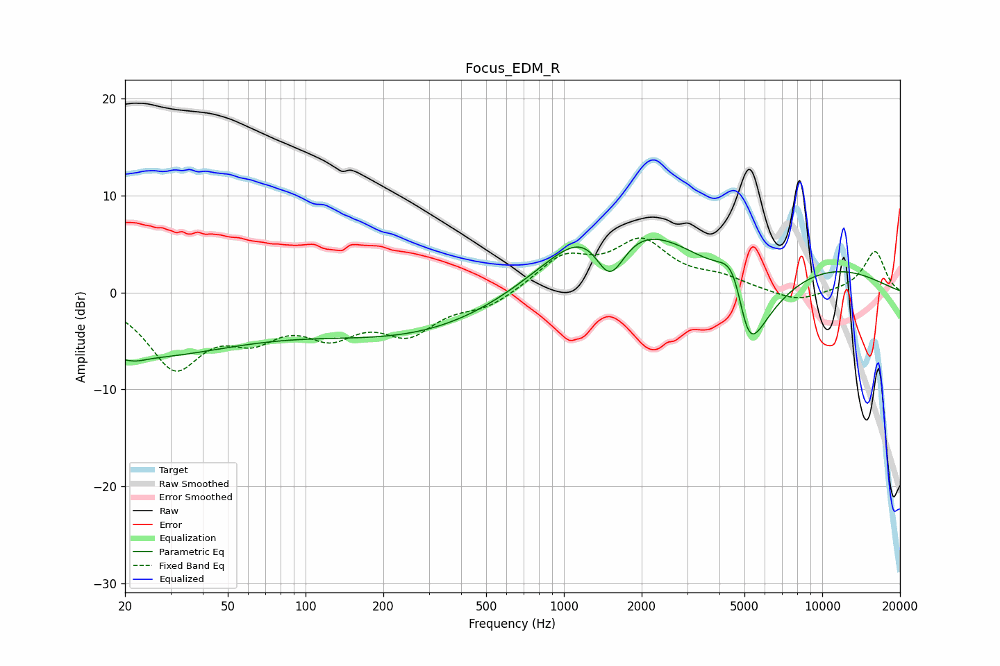

# Focus_EDM_R
See [usage instructions](https://github.com/jaakkopasanen/AutoEq#usage) for more options and info.

### Parametric EQs
Apply preamp of -5.6 dB when using parametric equalizer.

|   # | Type    |   Fc (Hz) |    Q |   Gain (dB) |
|-----|---------|-----------|------|-------------|
|   1 | Peaking |        20 | 0.35 |        -6.5 |
|   2 | Peaking |        22 | 3.65 |        -0.3 |
|   3 | Peaking |        25 | 1.02 |         0.2 |
|   4 | Peaking |       260 | 0.22 |        -3   |
|   5 | Peaking |       394 | 0.34 |        -2.5 |
|   6 | Peaking |      1394 | 1.02 |         5.8 |
|   7 | Peaking |      1503 | 2    |        -8.1 |
|   8 | Peaking |      3152 | 0.22 |         9.9 |
|   9 | Peaking |      4599 | 2.08 |         9   |
|  10 | Peaking |      5119 | 1.22 |       -20   |

### Fixed Band EQs
When using fixed band (also called graphic) equalizer, apply preamp of **-5.7 dB** (if available) and set gains manually with these parameters.

|   # | Type    |   Fc (Hz) |    Q |   Gain (dB) |
|-----|---------|-----------|------|-------------|
|   1 | Peaking |        31 | 1.41 |        -7.3 |
|   2 | Peaking |        62 | 1.41 |        -3.5 |
|   3 | Peaking |       125 | 1.41 |        -3.6 |
|   4 | Peaking |       250 | 1.41 |        -3.8 |
|   5 | Peaking |       500 | 1.41 |        -1.4 |
|   6 | Peaking |      1000 | 1.41 |         3.4 |
|   7 | Peaking |      2000 | 1.41 |         4.9 |
|   8 | Peaking |      4000 | 1.41 |         1.2 |
|   9 | Peaking |      8000 | 1.41 |        -1.1 |
|  10 | Peaking |     16000 | 1.41 |         4.3 |

### Graphs

