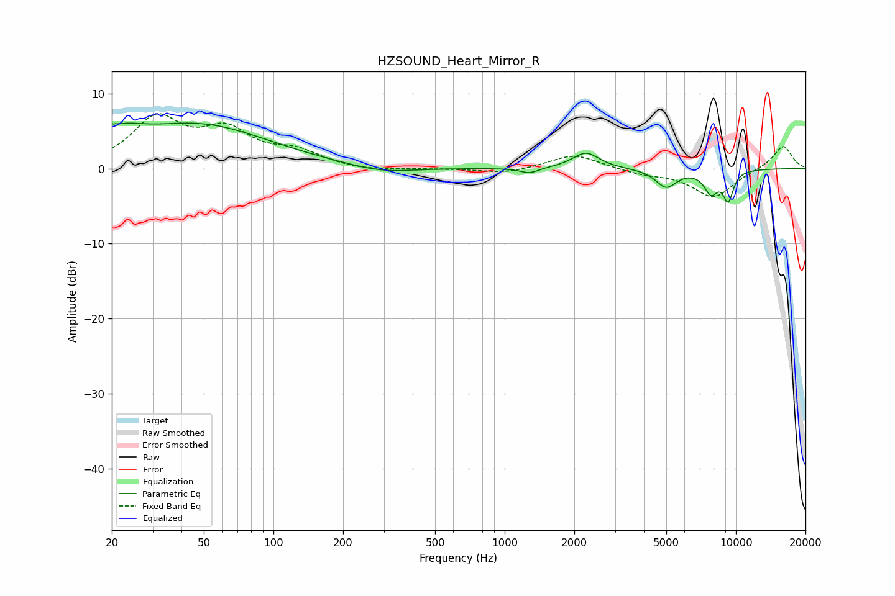

# HZSOUND_Heart_Mirror_R
See [usage instructions](https://github.com/jaakkopasanen/AutoEq#usage) for more options and info.

### Parametric EQs
Apply preamp of -6.2 dB when using parametric equalizer.

|   # | Type    |   Fc (Hz) |    Q |   Gain (dB) |
|-----|---------|-----------|------|-------------|
|   1 | Peaking |        20 | 5.26 |         3.4 |
|   2 | Peaking |        20 | 5.75 |        -2.4 |
|   3 | Peaking |        22 | 1.52 |         2   |
|   4 | Peaking |        47 | 0.46 |         5.7 |
|   5 | Peaking |       294 | 1.06 |        -0.9 |
|   6 | Peaking |      1279 | 3.59 |        -0.7 |
|   7 | Peaking |      2245 | 2.46 |         2.2 |
|   8 | Peaking |      4996 | 3.04 |        -2.4 |
|   9 | Peaking |      7808 | 4.27 |        -2.9 |
|  10 | Peaking |      9264 | 5.65 |        -3.8 |

### Fixed Band EQs
When using fixed band (also called graphic) equalizer, apply preamp of **-7.4 dB** (if available) and set gains manually with these parameters.

|   # | Type    |   Fc (Hz) |    Q |   Gain (dB) |
|-----|---------|-----------|------|-------------|
|   1 | Peaking |        31 | 1.41 |         6.4 |
|   2 | Peaking |        62 | 1.41 |         4.5 |
|   3 | Peaking |       125 | 1.41 |         2   |
|   4 | Peaking |       250 | 1.41 |        -0.4 |
|   5 | Peaking |       500 | 1.41 |        -0   |
|   6 | Peaking |      1000 | 1.41 |        -0.7 |
|   7 | Peaking |      2000 | 1.41 |         2   |
|   8 | Peaking |      4000 | 1.41 |        -0.6 |
|   9 | Peaking |      8000 | 1.41 |        -3.8 |
|  10 | Peaking |     16000 | 1.41 |         3.1 |

### Graphs

