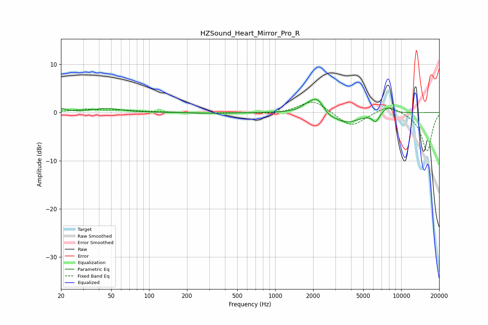

# HZSound_Heart_Mirror_Pro_R
See [usage instructions](https://github.com/jaakkopasanen/AutoEq#usage) for more options and info.

### Parametric EQs
Apply preamp of -2.8 dB when using parametric equalizer.

|   # | Type    |   Fc (Hz) |    Q |   Gain (dB) |
|-----|---------|-----------|------|-------------|
|   1 | Peaking |        20 | 3.48 |         0.7 |
|   2 | Peaking |        46 | 1.29 |         0.8 |
|   3 | Peaking |       342 | 1.11 |        -0.2 |
|   4 | Peaking |      1747 | 3.53 |         0.4 |
|   5 | Peaking |      1933 | 1.88 |         0.7 |
|   6 | Peaking |      2158 | 2.49 |         2.8 |
|   7 | Peaking |      2656 | 3.31 |        -0.7 |
|   8 | Peaking |      3663 | 1.32 |        -2.2 |
|   9 | Peaking |      6273 | 5.33 |        -1.7 |
|  10 | Peaking |      7829 | 3.1  |         1.3 |

### Fixed Band EQs
When using fixed band (also called graphic) equalizer, apply preamp of **-2.2 dB** (if available) and set gains manually with these parameters.

|   # | Type    |   Fc (Hz) |    Q |   Gain (dB) |
|-----|---------|-----------|------|-------------|
|   1 | Peaking |        31 | 1.41 |         0.6 |
|   2 | Peaking |        62 | 1.41 |         0.4 |
|   3 | Peaking |       125 | 1.41 |         0.1 |
|   4 | Peaking |       250 | 1.41 |        -0.2 |
|   5 | Peaking |       500 | 1.41 |        -0   |
|   6 | Peaking |      1000 | 1.41 |        -0.3 |
|   7 | Peaking |      2000 | 1.41 |         2.7 |
|   8 | Peaking |      4000 | 1.41 |        -3.1 |
|   9 | Peaking |      8000 | 1.41 |         1.8 |
|  10 | Peaking |     16000 | 1.41 |        -8.1 |

### Graphs

