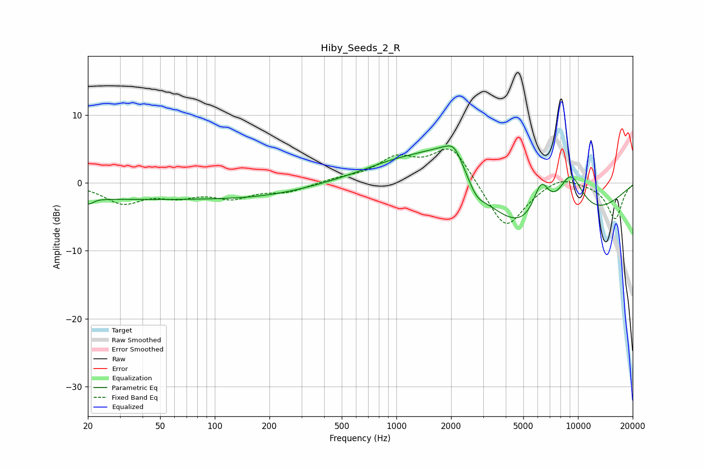

# Hiby_Seeds_2_R
See [usage instructions](https://github.com/jaakkopasanen/AutoEq#usage) for more options and info.

### Parametric EQs
Apply preamp of -5.5 dB when using parametric equalizer.

|   # | Type    |   Fc (Hz) |    Q |   Gain (dB) |
|-----|---------|-----------|------|-------------|
|   1 | Peaking |        20 | 5.84 |        -0.8 |
|   2 | Peaking |        35 | 0.18 |        -2.4 |
|   3 | Peaking |       214 | 0.55 |        -0.9 |
|   4 | Peaking |      1051 | 0.63 |         3   |
|   5 | Peaking |      1992 | 0.88 |         7   |
|   6 | Peaking |      2080 | 3.31 |         1.9 |
|   7 | Peaking |      2749 | 2.87 |        -2.1 |
|   8 | Peaking |      6203 | 0.36 |       -10.4 |
|   9 | Peaking |      6264 | 2.8  |         6   |
|  10 | Peaking |      9053 | 1.49 |         8.7 |

### Fixed Band EQs
When using fixed band (also called graphic) equalizer, apply preamp of **-5.1 dB** (if available) and set gains manually with these parameters.

|   # | Type    |   Fc (Hz) |    Q |   Gain (dB) |
|-----|---------|-----------|------|-------------|
|   1 | Peaking |        31 | 1.41 |        -2.8 |
|   2 | Peaking |        62 | 1.41 |        -1.6 |
|   3 | Peaking |       125 | 1.41 |        -2   |
|   4 | Peaking |       250 | 1.41 |        -1.2 |
|   5 | Peaking |       500 | 1.41 |         0.5 |
|   6 | Peaking |      1000 | 1.41 |         3.3 |
|   7 | Peaking |      2000 | 1.41 |         5.5 |
|   8 | Peaking |      4000 | 1.41 |        -7.2 |
|   9 | Peaking |      8000 | 1.41 |         1.3 |
|  10 | Peaking |     16000 | 1.41 |        -5.3 |

### Graphs

