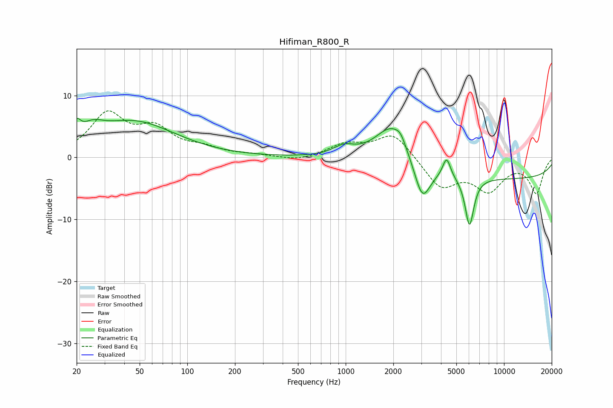

# Hifiman_R800_R
See [usage instructions](https://github.com/jaakkopasanen/AutoEq#usage) for more options and info.

### Parametric EQs
Apply preamp of -6.4 dB when using parametric equalizer.

|   # | Type    |   Fc (Hz) |    Q |   Gain (dB) |
|-----|---------|-----------|------|-------------|
|   1 | Peaking |        20 | 5.86 |         2.3 |
|   2 | Peaking |        25 | 1.98 |         2   |
|   3 | Peaking |        46 | 0.54 |         5.7 |
|   4 | Peaking |       973 | 2.15 |         1.5 |
|   5 | Peaking |      1965 | 1.32 |         6.4 |
|   6 | Peaking |      2223 | 4.68 |         1.2 |
|   7 | Peaking |      3049 | 2.75 |        -6.2 |
|   8 | Peaking |      4339 | 5.7  |         3.2 |
|   9 | Peaking |      6053 | 4.94 |        -7.9 |
|  10 | Peaking |     10000 | 0.18 |        -3.4 |

### Fixed Band EQs
When using fixed band (also called graphic) equalizer, apply preamp of **-7.6 dB** (if available) and set gains manually with these parameters.

|   # | Type    |   Fc (Hz) |    Q |   Gain (dB) |
|-----|---------|-----------|------|-------------|
|   1 | Peaking |        31 | 1.41 |         6.7 |
|   2 | Peaking |        62 | 1.41 |         4.1 |
|   3 | Peaking |       125 | 1.41 |         1.2 |
|   4 | Peaking |       250 | 1.41 |         0.3 |
|   5 | Peaking |       500 | 1.41 |        -0.7 |
|   6 | Peaking |      1000 | 1.41 |         2   |
|   7 | Peaking |      2000 | 1.41 |         4   |
|   8 | Peaking |      4000 | 1.41 |        -4.8 |
|   9 | Peaking |      8000 | 1.41 |        -4.9 |
|  10 | Peaking |     16000 | 1.41 |        -5.6 |

### Graphs

