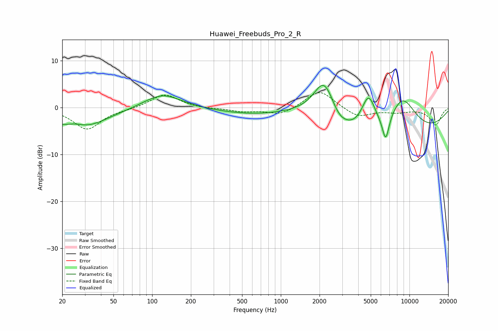

# Huawei_Freebuds_Pro_2_R
See [usage instructions](https://github.com/jaakkopasanen/AutoEq#usage) for more options and info.

### Parametric EQs
Apply preamp of -4.9 dB when using parametric equalizer.

|   # | Type    |   Fc (Hz) |    Q |   Gain (dB) |
|-----|---------|-----------|------|-------------|
|   1 | Peaking |        25 | 1.8  |         1.7 |
|   2 | Peaking |        26 | 0.73 |        -5.3 |
|   3 | Peaking |       120 | 0.98 |         3.2 |
|   4 | Peaking |      1317 | 0.5  |         6.1 |
|   5 | Peaking |      2172 | 1.45 |        11   |
|   6 | Peaking |      2825 | 2.81 |        -1   |
|   7 | Peaking |      4002 | 0.18 |       -12.9 |
|   8 | Peaking |      4803 | 2.3  |         8.4 |
|   9 | Peaking |      6536 | 5.03 |        -5.4 |
|  10 | Peaking |      8760 | 0.94 |        11.3 |

### Fixed Band EQs
When using fixed band (also called graphic) equalizer, apply preamp of **-3.3 dB** (if available) and set gains manually with these parameters.

|   # | Type    |   Fc (Hz) |    Q |   Gain (dB) |
|-----|---------|-----------|------|-------------|
|   1 | Peaking |        31 | 1.41 |        -4.6 |
|   2 | Peaking |        62 | 1.41 |        -0.2 |
|   3 | Peaking |       125 | 1.41 |         3   |
|   4 | Peaking |       250 | 1.41 |        -0.2 |
|   5 | Peaking |       500 | 1.41 |        -0.8 |
|   6 | Peaking |      1000 | 1.41 |        -1.6 |
|   7 | Peaking |      2000 | 1.41 |         3.9 |
|   8 | Peaking |      4000 | 1.41 |        -2.1 |
|   9 | Peaking |      8000 | 1.41 |        -0.8 |
|  10 | Peaking |     16000 | 1.41 |        -3.6 |

### Graphs

