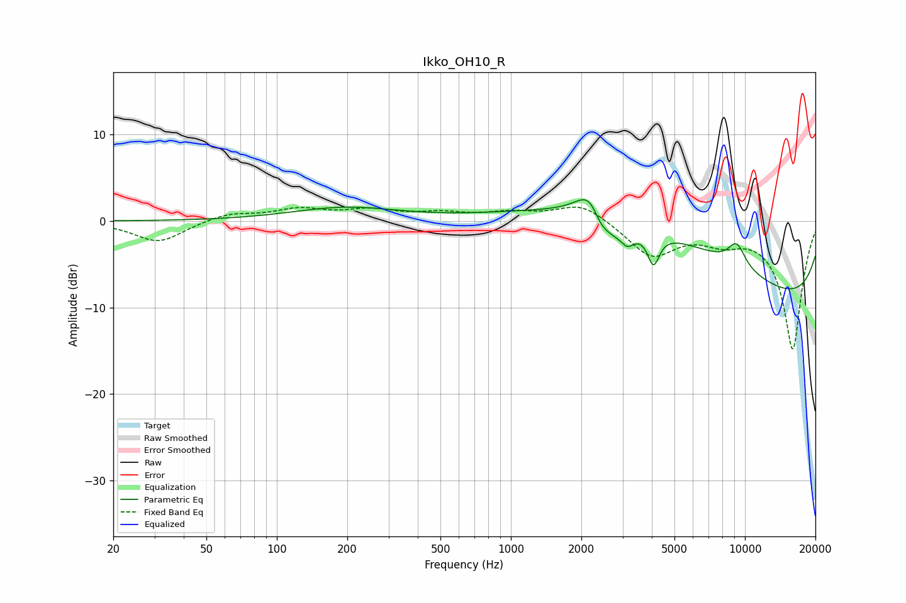

# Ikko_OH10_R
See [usage instructions](https://github.com/jaakkopasanen/AutoEq#usage) for more options and info.

### Parametric EQs
Apply preamp of -2.6 dB when using parametric equalizer.

|   # | Type    |   Fc (Hz) |    Q |   Gain (dB) |
|-----|---------|-----------|------|-------------|
|   1 | Peaking |       196 | 0.62 |         1.5 |
|   2 | Peaking |      2251 | 2.36 |         4.8 |
|   3 | Peaking |      2391 | 3.41 |        -3.3 |
|   4 | Peaking |      2742 | 2.67 |        -1.8 |
|   5 | Peaking |      3043 | 4.38 |         2.2 |
|   6 | Peaking |      3097 | 4.22 |        -3.9 |
|   7 | Peaking |      4066 | 5.54 |        -3.6 |
|   8 | Peaking |      4656 | 0.28 |         8.4 |
|   9 | Peaking |      9221 | 3.37 |         2.7 |
|  10 | Peaking |     10000 | 0.18 |       -12   |

### Fixed Band EQs
When using fixed band (also called graphic) equalizer, apply preamp of **-1.7 dB** (if available) and set gains manually with these parameters.

|   # | Type    |   Fc (Hz) |    Q |   Gain (dB) |
|-----|---------|-----------|------|-------------|
|   1 | Peaking |        31 | 1.41 |        -2.5 |
|   2 | Peaking |        62 | 1.41 |         0.9 |
|   3 | Peaking |       125 | 1.41 |         1.3 |
|   4 | Peaking |       250 | 1.41 |         1.1 |
|   5 | Peaking |       500 | 1.41 |         0.8 |
|   6 | Peaking |      1000 | 1.41 |         0.8 |
|   7 | Peaking |      2000 | 1.41 |         2.1 |
|   8 | Peaking |      4000 | 1.41 |        -4   |
|   9 | Peaking |      8000 | 1.41 |        -1.7 |
|  10 | Peaking |     16000 | 1.41 |       -14.8 |

### Graphs

