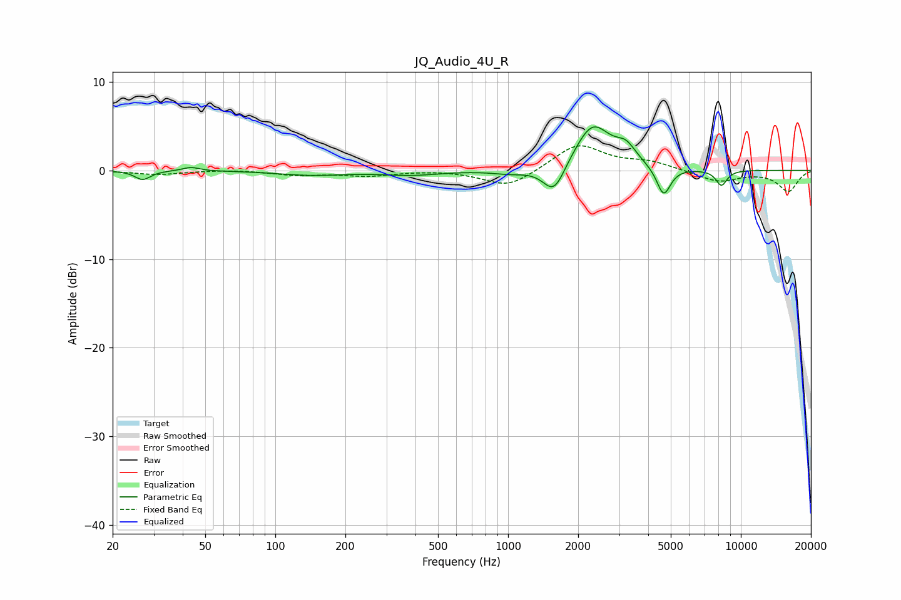

# JQ_Audio_4U_R
See [usage instructions](https://github.com/jaakkopasanen/AutoEq#usage) for more options and info.

### Parametric EQs
Apply preamp of -5.0 dB when using parametric equalizer.

|   # | Type    |   Fc (Hz) |    Q |   Gain (dB) |
|-----|---------|-----------|------|-------------|
|   1 | Peaking |        27 | 4.31 |        -1   |
|   2 | Peaking |        43 | 4.04 |         0.4 |
|   3 | Peaking |       143 | 0.97 |        -0.5 |
|   4 | Peaking |       383 | 1.16 |        -0.5 |
|   5 | Peaking |      1018 | 1.88 |        -0.4 |
|   6 | Peaking |      1576 | 2.97 |        -3.4 |
|   7 | Peaking |      2307 | 1.83 |         5.2 |
|   8 | Peaking |      3213 | 3.19 |         1.8 |
|   9 | Peaking |      4660 | 4.74 |        -3.3 |
|  10 | Peaking |      8257 | 5.45 |        -1.7 |

### Fixed Band EQs
When using fixed band (also called graphic) equalizer, apply preamp of **-2.9 dB** (if available) and set gains manually with these parameters.

|   # | Type    |   Fc (Hz) |    Q |   Gain (dB) |
|-----|---------|-----------|------|-------------|
|   1 | Peaking |        31 | 1.41 |        -0.5 |
|   2 | Peaking |        62 | 1.41 |         0.1 |
|   3 | Peaking |       125 | 1.41 |        -0.5 |
|   4 | Peaking |       250 | 1.41 |        -0.6 |
|   5 | Peaking |       500 | 1.41 |         0.1 |
|   6 | Peaking |      1000 | 1.41 |        -2   |
|   7 | Peaking |      2000 | 1.41 |         3   |
|   8 | Peaking |      4000 | 1.41 |         0.9 |
|   9 | Peaking |      8000 | 1.41 |        -1.3 |
|  10 | Peaking |     16000 | 1.41 |        -2.3 |

### Graphs

