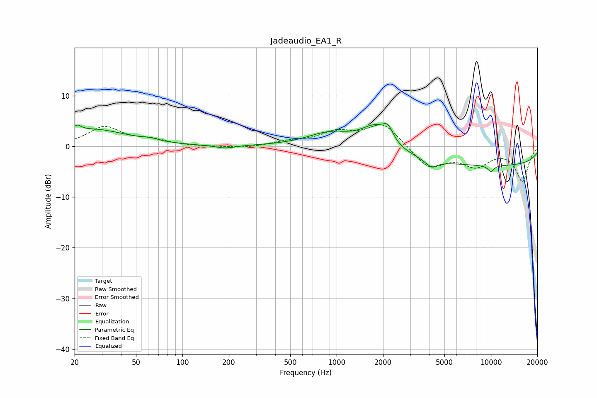

# Jadeaudio_EA1_R
See [usage instructions](https://github.com/jaakkopasanen/AutoEq#usage) for more options and info.

### Parametric EQs
Apply preamp of -4.6 dB when using parametric equalizer.

|   # | Type    |   Fc (Hz) |    Q |   Gain (dB) |
|-----|---------|-----------|------|-------------|
|   1 | Peaking |        21 | 5.43 |         1.2 |
|   2 | Peaking |        26 | 0.64 |         3.3 |
|   3 | Peaking |        62 | 2.77 |         0.4 |
|   4 | Peaking |       189 | 2.19 |        -0.6 |
|   5 | Peaking |       912 | 0.94 |         2.8 |
|   6 | Peaking |      1767 | 1.56 |         4.2 |
|   7 | Peaking |      2151 | 4.15 |         2.6 |
|   8 | Peaking |      4103 | 3.47 |        -1.5 |
|   9 | Peaking |     10000 | 0.18 |        -3.8 |
|  10 | Peaking |     10000 | 5.93 |        -1.2 |

### Fixed Band EQs
When using fixed band (also called graphic) equalizer, apply preamp of **-4.3 dB** (if available) and set gains manually with these parameters.

|   # | Type    |   Fc (Hz) |    Q |   Gain (dB) |
|-----|---------|-----------|------|-------------|
|   1 | Peaking |        31 | 1.41 |         3.7 |
|   2 | Peaking |        62 | 1.41 |         1.1 |
|   3 | Peaking |       125 | 1.41 |        -0.1 |
|   4 | Peaking |       250 | 1.41 |        -0.4 |
|   5 | Peaking |       500 | 1.41 |         0.8 |
|   6 | Peaking |      1000 | 1.41 |         2.5 |
|   7 | Peaking |      2000 | 1.41 |         4.5 |
|   8 | Peaking |      4000 | 1.41 |        -4.3 |
|   9 | Peaking |      8000 | 1.41 |        -3.5 |
|  10 | Peaking |     16000 | 1.41 |        -6.7 |

### Graphs

