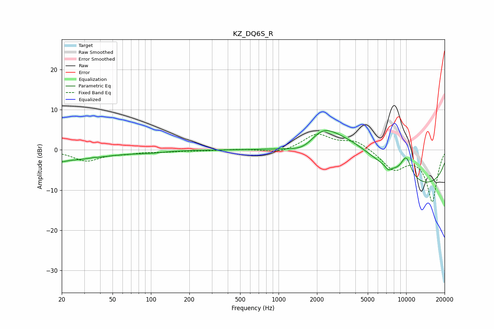

# KZ_DQ6S_R
See [usage instructions](https://github.com/jaakkopasanen/AutoEq#usage) for more options and info.

### Parametric EQs
Apply preamp of -4.9 dB when using parametric equalizer.

|   # | Type    |   Fc (Hz) |    Q |   Gain (dB) |
|-----|---------|-----------|------|-------------|
|   1 | Peaking |        20 | 0.44 |        -2.5 |
|   2 | Peaking |        20 | 4.82 |        -0.4 |
|   3 | Peaking |        35 | 5.87 |         0.1 |
|   4 | Peaking |        98 | 1.44 |        -0.4 |
|   5 | Peaking |      1622 | 1.27 |        -2.7 |
|   6 | Peaking |      2188 | 1.21 |         4.9 |
|   7 | Peaking |      3566 | 0.49 |         9   |
|   8 | Peaking |      7244 | 5.83 |        -1   |
|   9 | Peaking |      9436 | 0.18 |       -10.3 |
|  10 | Peaking |     10000 | 2.81 |         5.3 |

### Fixed Band EQs
When using fixed band (also called graphic) equalizer, apply preamp of **-4.0 dB** (if available) and set gains manually with these parameters.

|   # | Type    |   Fc (Hz) |    Q |   Gain (dB) |
|-----|---------|-----------|------|-------------|
|   1 | Peaking |        31 | 1.41 |        -2.7 |
|   2 | Peaking |        62 | 1.41 |        -0.7 |
|   3 | Peaking |       125 | 1.41 |        -0.4 |
|   4 | Peaking |       250 | 1.41 |        -0.2 |
|   5 | Peaking |       500 | 1.41 |         0.2 |
|   6 | Peaking |      1000 | 1.41 |        -0.9 |
|   7 | Peaking |      2000 | 1.41 |         3.9 |
|   8 | Peaking |      4000 | 1.41 |         2.3 |
|   9 | Peaking |      8000 | 1.41 |        -4.7 |
|  10 | Peaking |     16000 | 1.41 |       -12.8 |

### Graphs

