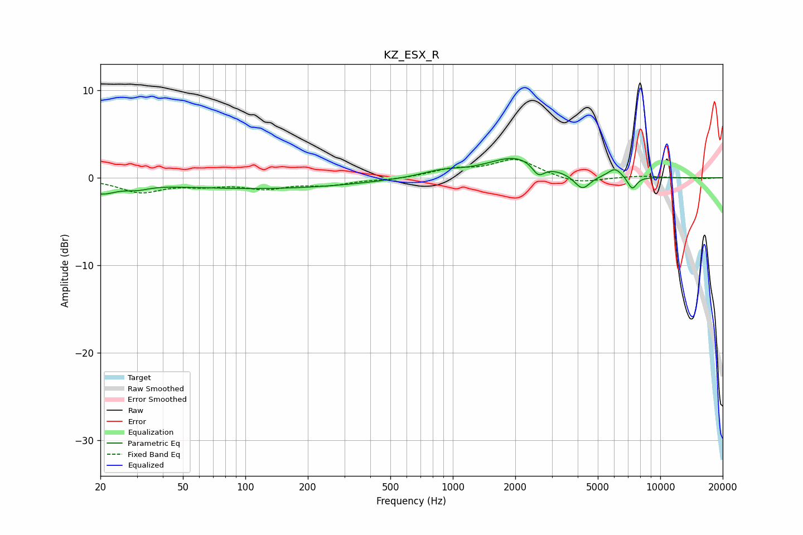

# KZ_ESX_R
See [usage instructions](https://github.com/jaakkopasanen/AutoEq#usage) for more options and info.

### Parametric EQs
Apply preamp of -2.3 dB when using parametric equalizer.

|   # | Type    |   Fc (Hz) |    Q |   Gain (dB) |
|-----|---------|-----------|------|-------------|
|   1 | Peaking |        20 | 1.86 |        -1.4 |
|   2 | Peaking |        30 | 2.46 |        -0.5 |
|   3 | Peaking |        55 | 1.51 |        -0   |
|   4 | Peaking |       118 | 0.29 |        -1.2 |
|   5 | Peaking |       884 | 1.36 |         0.7 |
|   6 | Peaking |      2021 | 1.04 |         2.4 |
|   7 | Peaking |      2588 | 4.73 |        -1.4 |
|   8 | Peaking |      4209 | 3.66 |        -1.7 |
|   9 | Peaking |      6054 | 4.07 |         1   |
|  10 | Peaking |      7326 | 6    |        -1.5 |

### Fixed Band EQs
When using fixed band (also called graphic) equalizer, apply preamp of **-2.2 dB** (if available) and set gains manually with these parameters.

|   # | Type    |   Fc (Hz) |    Q |   Gain (dB) |
|-----|---------|-----------|------|-------------|
|   1 | Peaking |        31 | 1.41 |        -1.6 |
|   2 | Peaking |        62 | 1.41 |        -0.7 |
|   3 | Peaking |       125 | 1.41 |        -1.1 |
|   4 | Peaking |       250 | 1.41 |        -0.7 |
|   5 | Peaking |       500 | 1.41 |        -0.2 |
|   6 | Peaking |      1000 | 1.41 |         0.9 |
|   7 | Peaking |      2000 | 1.41 |         2.1 |
|   8 | Peaking |      4000 | 1.41 |        -0.7 |
|   9 | Peaking |      8000 | 1.41 |         0.2 |
|  10 | Peaking |     16000 | 1.41 |        -0.1 |

### Graphs

