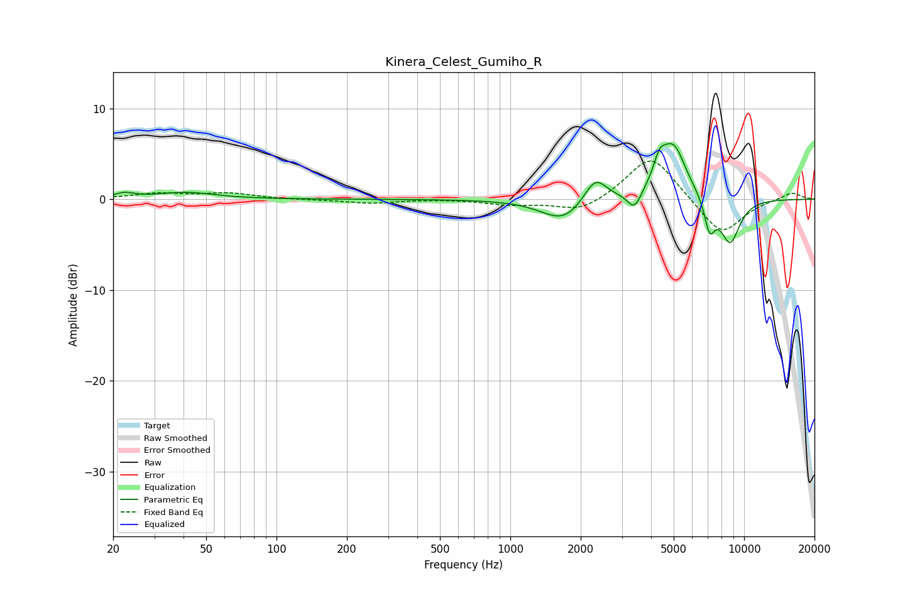

# Kinera_Celest_Gumiho_R
See [usage instructions](https://github.com/jaakkopasanen/AutoEq#usage) for more options and info.

### Parametric EQs
Apply preamp of -6.2 dB when using parametric equalizer.

|   # | Type    |   Fc (Hz) |    Q |   Gain (dB) |
|-----|---------|-----------|------|-------------|
|   1 | Peaking |        22 | 3.49 |         0.5 |
|   2 | Peaking |        41 | 1.18 |         0.7 |
|   3 | Peaking |      1685 | 1.53 |        -2.5 |
|   4 | Peaking |      2306 | 2.87 |         2.9 |
|   5 | Peaking |      3398 | 4.56 |        -2.1 |
|   6 | Peaking |      4339 | 6    |         1.8 |
|   7 | Peaking |      4915 | 2.29 |         5.9 |
|   8 | Peaking |      5172 | 4.87 |         0.3 |
|   9 | Peaking |      7124 | 5.82 |        -3.5 |
|  10 | Peaking |      8704 | 2.95 |        -4.9 |

### Fixed Band EQs
When using fixed band (also called graphic) equalizer, apply preamp of **-4.3 dB** (if available) and set gains manually with these parameters.

|   # | Type    |   Fc (Hz) |    Q |   Gain (dB) |
|-----|---------|-----------|------|-------------|
|   1 | Peaking |        31 | 1.41 |         0.6 |
|   2 | Peaking |        62 | 1.41 |         0.6 |
|   3 | Peaking |       125 | 1.41 |        -0   |
|   4 | Peaking |       250 | 1.41 |        -0.4 |
|   5 | Peaking |       500 | 1.41 |         0   |
|   6 | Peaking |      1000 | 1.41 |        -0.6 |
|   7 | Peaking |      2000 | 1.41 |        -1.5 |
|   8 | Peaking |      4000 | 1.41 |         5.1 |
|   9 | Peaking |      8000 | 1.41 |        -4.1 |
|  10 | Peaking |     16000 | 1.41 |         0.8 |

### Graphs

