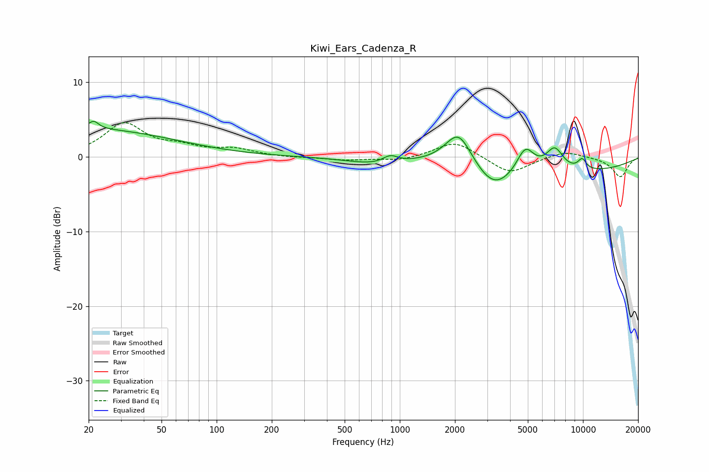

# Kiwi_Ears_Cadenza_R
See [usage instructions](https://github.com/jaakkopasanen/AutoEq#usage) for more options and info.

### Parametric EQs
Apply preamp of -4.9 dB when using parametric equalizer.

|   # | Type    |   Fc (Hz) |    Q |   Gain (dB) |
|-----|---------|-----------|------|-------------|
|   1 | Peaking |        20 | 0.3  |         3.7 |
|   2 | Peaking |        21 | 5.19 |         1.1 |
|   3 | Peaking |       772 | 0.91 |        -1   |
|   4 | Peaking |       888 | 3.22 |         1.1 |
|   5 | Peaking |      2095 | 1.96 |         4.6 |
|   6 | Peaking |      3261 | 1.35 |        -3.4 |
|   7 | Peaking |      4846 | 2.91 |         3.4 |
|   8 | Peaking |      7007 | 2.86 |         3   |
|   9 | Peaking |      8530 | 0.31 |        -2   |
|  10 | Peaking |      9895 | 5.24 |         1.4 |

### Fixed Band EQs
When using fixed band (also called graphic) equalizer, apply preamp of **-4.7 dB** (if available) and set gains manually with these parameters.

|   # | Type    |   Fc (Hz) |    Q |   Gain (dB) |
|-----|---------|-----------|------|-------------|
|   1 | Peaking |        31 | 1.41 |         4.3 |
|   2 | Peaking |        62 | 1.41 |         1.1 |
|   3 | Peaking |       125 | 1.41 |         0.9 |
|   4 | Peaking |       250 | 1.41 |        -0.1 |
|   5 | Peaking |       500 | 1.41 |        -0.4 |
|   6 | Peaking |      1000 | 1.41 |        -0.5 |
|   7 | Peaking |      2000 | 1.41 |         2.2 |
|   8 | Peaking |      4000 | 1.41 |        -2.3 |
|   9 | Peaking |      8000 | 1.41 |         0.9 |
|  10 | Peaking |     16000 | 1.41 |        -2.7 |

### Graphs

