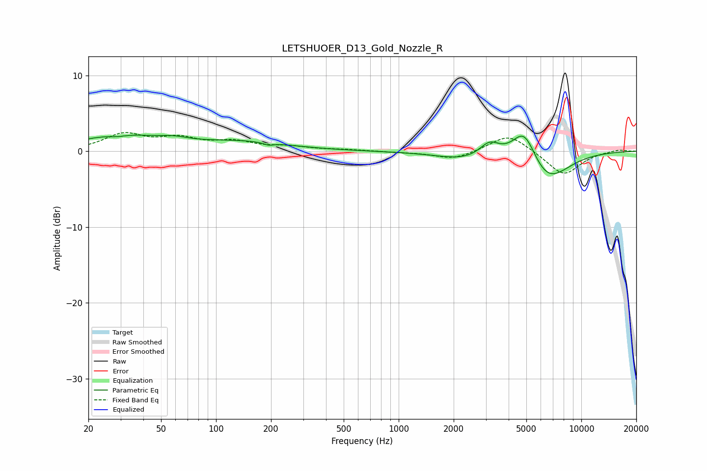

# LETSHUOER_D13_Gold_Nozzle_R
See [usage instructions](https://github.com/jaakkopasanen/AutoEq#usage) for more options and info.

### Parametric EQs
Apply preamp of -2.2 dB when using parametric equalizer.

|   # | Type    |   Fc (Hz) |    Q |   Gain (dB) |
|-----|---------|-----------|------|-------------|
|   1 | Peaking |        29 | 3.23 |        -0.3 |
|   2 | Peaking |        30 | 0.62 |         2   |
|   3 | Peaking |        59 | 1.85 |         0.5 |
|   4 | Peaking |       141 | 0.58 |         1.1 |
|   5 | Peaking |       195 | 5.44 |        -0.3 |
|   6 | Peaking |      2290 | 0.93 |        -1   |
|   7 | Peaking |      3140 | 2.62 |         1.9 |
|   8 | Peaking |      4877 | 2.13 |         4.5 |
|   9 | Peaking |      6471 | 1.2  |        -4.2 |
|  10 | Peaking |      8537 | 4.67 |        -0   |

### Fixed Band EQs
When using fixed band (also called graphic) equalizer, apply preamp of **-2.6 dB** (if available) and set gains manually with these parameters.

|   # | Type    |   Fc (Hz) |    Q |   Gain (dB) |
|-----|---------|-----------|------|-------------|
|   1 | Peaking |        31 | 1.41 |         2.1 |
|   2 | Peaking |        62 | 1.41 |         1.5 |
|   3 | Peaking |       125 | 1.41 |         1.1 |
|   4 | Peaking |       250 | 1.41 |         0.5 |
|   5 | Peaking |       500 | 1.41 |         0.2 |
|   6 | Peaking |      1000 | 1.41 |        -0.1 |
|   7 | Peaking |      2000 | 1.41 |        -1.1 |
|   8 | Peaking |      4000 | 1.41 |         2.4 |
|   9 | Peaking |      8000 | 1.41 |        -3.2 |
|  10 | Peaking |     16000 | 1.41 |         0.3 |

### Graphs

