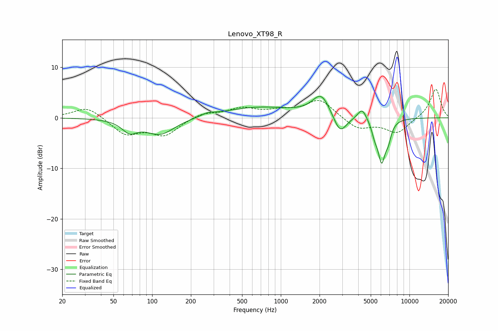

# Lenovo_XT98_R
See [usage instructions](https://github.com/jaakkopasanen/AutoEq#usage) for more options and info.

### Parametric EQs
Apply preamp of -4.3 dB when using parametric equalizer.

|   # | Type    |   Fc (Hz) |    Q |   Gain (dB) |
|-----|---------|-----------|------|-------------|
|   1 | Peaking |        67 | 2.46 |        -2.2 |
|   2 | Peaking |       115 | 1.25 |        -3.3 |
|   3 | Peaking |       270 | 3.01 |         0.5 |
|   4 | Peaking |       677 | 0.49 |         2.1 |
|   5 | Peaking |      2060 | 2.08 |         4.3 |
|   6 | Peaking |      2883 | 2.76 |        -3.9 |
|   7 | Peaking |      4288 | 4.05 |         2.3 |
|   8 | Peaking |      5365 | 5.97 |        -1.9 |
|   9 | Peaking |      6076 | 4.54 |        -8.1 |
|  10 | Peaking |      6850 | 6    |        -2.5 |

### Fixed Band EQs
When using fixed band (also called graphic) equalizer, apply preamp of **-5.7 dB** (if available) and set gains manually with these parameters.

|   # | Type    |   Fc (Hz) |    Q |   Gain (dB) |
|-----|---------|-----------|------|-------------|
|   1 | Peaking |        31 | 1.41 |         2.3 |
|   2 | Peaking |        62 | 1.41 |        -3.2 |
|   3 | Peaking |       125 | 1.41 |        -3.3 |
|   4 | Peaking |       250 | 1.41 |         1   |
|   5 | Peaking |       500 | 1.41 |         1.8 |
|   6 | Peaking |      1000 | 1.41 |         1.1 |
|   7 | Peaking |      2000 | 1.41 |         3.6 |
|   8 | Peaking |      4000 | 1.41 |        -2.3 |
|   9 | Peaking |      8000 | 1.41 |        -3   |
|  10 | Peaking |     16000 | 1.41 |         5.8 |

### Graphs

