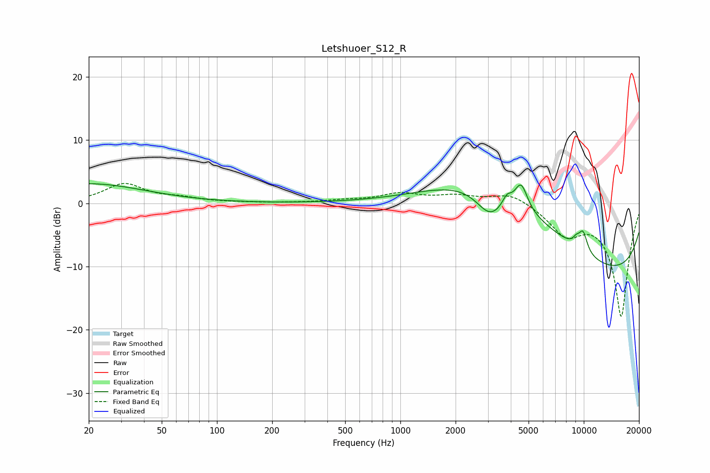

# Letshuoer_S12_R
See [usage instructions](https://github.com/jaakkopasanen/AutoEq#usage) for more options and info.

### Parametric EQs
Apply preamp of -3.2 dB when using parametric equalizer.

|   # | Type    |   Fc (Hz) |    Q |   Gain (dB) |
|-----|---------|-----------|------|-------------|
|   1 | Peaking |        20 | 0.46 |         3.1 |
|   2 | Peaking |      2962 | 0.48 |         5.3 |
|   3 | Peaking |      3081 | 1.85 |        -4.2 |
|   4 | Peaking |      3808 | 5.73 |         1.6 |
|   5 | Peaking |      4333 | 0.32 |         6   |
|   6 | Peaking |      4553 | 4.02 |         4.2 |
|   7 | Peaking |      9100 | 5.73 |         2.5 |
|   8 | Peaking |      9102 | 5.2  |        -1.5 |
|   9 | Peaking |      9907 | 5.18 |         3.2 |
|  10 | Peaking |     10000 | 0.18 |       -13   |

### Fixed Band EQs
When using fixed band (also called graphic) equalizer, apply preamp of **-3.2 dB** (if available) and set gains manually with these parameters.

|   # | Type    |   Fc (Hz) |    Q |   Gain (dB) |
|-----|---------|-----------|------|-------------|
|   1 | Peaking |        31 | 1.41 |         3   |
|   2 | Peaking |        62 | 1.41 |         0.7 |
|   3 | Peaking |       125 | 1.41 |         0.1 |
|   4 | Peaking |       250 | 1.41 |         0   |
|   5 | Peaking |       500 | 1.41 |         0.4 |
|   6 | Peaking |      1000 | 1.41 |         1.4 |
|   7 | Peaking |      2000 | 1.41 |         1.1 |
|   8 | Peaking |      4000 | 1.41 |         1.7 |
|   9 | Peaking |      8000 | 1.41 |        -4.3 |
|  10 | Peaking |     16000 | 1.41 |       -17.8 |

### Graphs

