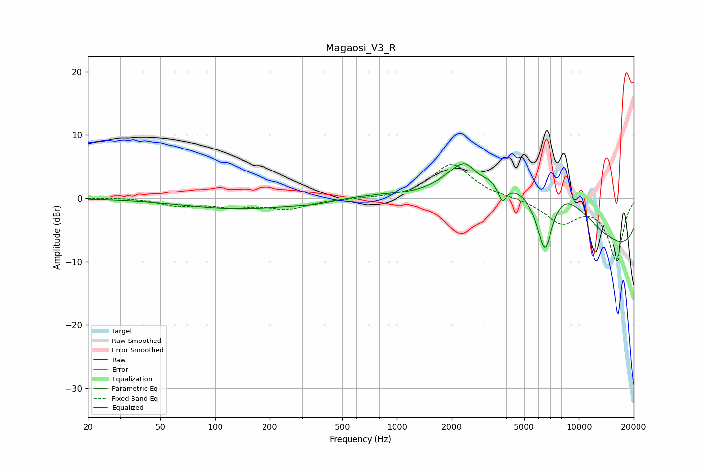

# Magaosi_V3_R
See [usage instructions](https://github.com/jaakkopasanen/AutoEq#usage) for more options and info.

### Parametric EQs
Apply preamp of -5.6 dB when using parametric equalizer.

|   # | Type    |   Fc (Hz) |    Q |   Gain (dB) |
|-----|---------|-----------|------|-------------|
|   1 | Peaking |       143 | 0.39 |        -2.8 |
|   2 | Peaking |       272 | 0.18 |         1.3 |
|   3 | Peaking |       355 | 1.34 |        -0.5 |
|   4 | Peaking |       840 | 1.21 |         0.3 |
|   5 | Peaking |      2547 | 1.28 |         9.7 |
|   6 | Peaking |      2731 | 2.28 |        -4.1 |
|   7 | Peaking |      3787 | 5.78 |        -2.9 |
|   8 | Peaking |      6504 | 2.58 |       -12.3 |
|   9 | Peaking |      7172 | 0.43 |        18.7 |
|  10 | Peaking |     10000 | 0.18 |       -15.7 |

### Fixed Band EQs
When using fixed band (also called graphic) equalizer, apply preamp of **-5.4 dB** (if available) and set gains manually with these parameters.

|   # | Type    |   Fc (Hz) |    Q |   Gain (dB) |
|-----|---------|-----------|------|-------------|
|   1 | Peaking |        31 | 1.41 |         0.1 |
|   2 | Peaking |        62 | 1.41 |        -1.1 |
|   3 | Peaking |       125 | 1.41 |        -1.1 |
|   4 | Peaking |       250 | 1.41 |        -1.5 |
|   5 | Peaking |       500 | 1.41 |        -0.1 |
|   6 | Peaking |      1000 | 1.41 |        -0.1 |
|   7 | Peaking |      2000 | 1.41 |         5.5 |
|   8 | Peaking |      4000 | 1.41 |         0.1 |
|   9 | Peaking |      8000 | 1.41 |        -3.7 |
|  10 | Peaking |     16000 | 1.41 |        -9.7 |

### Graphs

