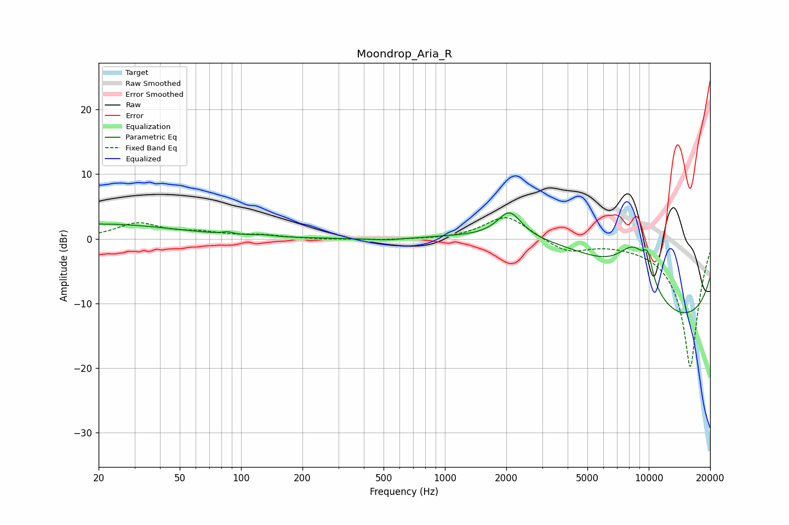

# Moondrop_Aria_R
See [usage instructions](https://github.com/jaakkopasanen/AutoEq#usage) for more options and info.

### Parametric EQs
Apply preamp of -4.1 dB when using parametric equalizer.

|   # | Type    |   Fc (Hz) |    Q |   Gain (dB) |
|-----|---------|-----------|------|-------------|
|   1 | Peaking |        20 | 0.37 |         2.3 |
|   2 | Peaking |        86 | 5.98 |         0.3 |
|   3 | Peaking |       127 | 2.59 |         0.2 |
|   4 | Peaking |       531 | 1.39 |        -0.4 |
|   5 | Peaking |       627 | 5.9  |         0   |
|   6 | Peaking |      2076 | 2.41 |         4.1 |
|   7 | Peaking |      4669 | 0.29 |        11   |
|   8 | Peaking |      8511 | 1.46 |         7.5 |
|   9 | Peaking |      9882 | 5.4  |         3.4 |
|  10 | Peaking |     10000 | 0.2  |       -18.6 |

### Fixed Band EQs
When using fixed band (also called graphic) equalizer, apply preamp of **-3.4 dB** (if available) and set gains manually with these parameters.

|   # | Type    |   Fc (Hz) |    Q |   Gain (dB) |
|-----|---------|-----------|------|-------------|
|   1 | Peaking |        31 | 1.41 |         2.3 |
|   2 | Peaking |        62 | 1.41 |         0.8 |
|   3 | Peaking |       125 | 1.41 |         0.5 |
|   4 | Peaking |       250 | 1.41 |        -0.1 |
|   5 | Peaking |       500 | 1.41 |        -0.2 |
|   6 | Peaking |      1000 | 1.41 |        -0.1 |
|   7 | Peaking |      2000 | 1.41 |         3.7 |
|   8 | Peaking |      4000 | 1.41 |        -2   |
|   9 | Peaking |      8000 | 1.41 |        -0.2 |
|  10 | Peaking |     16000 | 1.41 |       -20   |

### Graphs

