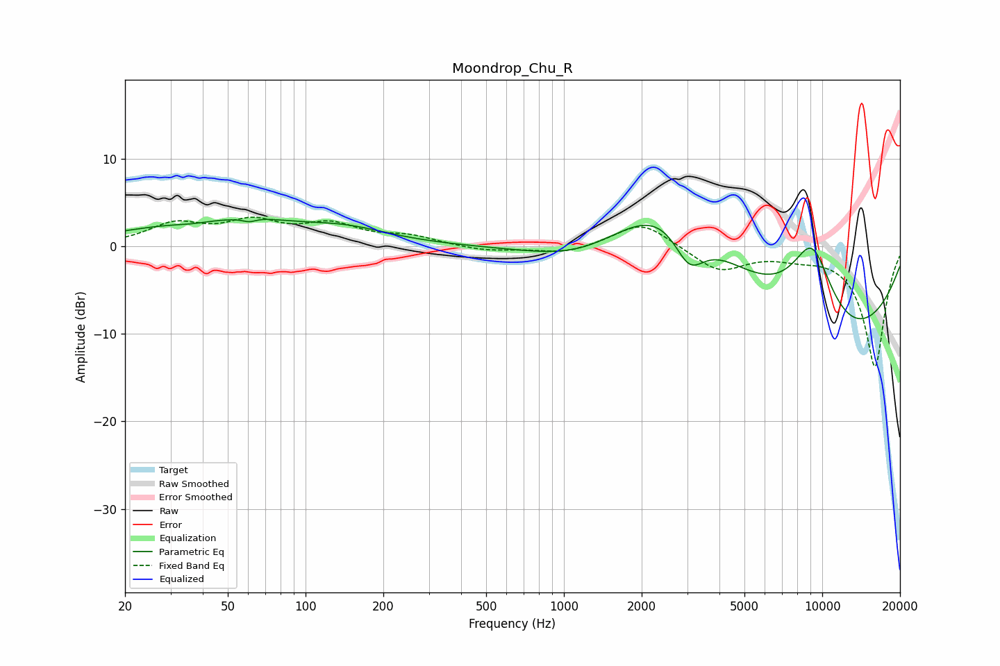

# Moondrop_Chu_R
See [usage instructions](https://github.com/jaakkopasanen/AutoEq#usage) for more options and info.

### Parametric EQs
Apply preamp of -3.2 dB when using parametric equalizer.

|   # | Type    |   Fc (Hz) |    Q |   Gain (dB) |
|-----|---------|-----------|------|-------------|
|   1 | Peaking |        36 | 1.98 |        -0.3 |
|   2 | Peaking |        46 | 0.41 |         2.8 |
|   3 | Peaking |        61 | 5.32 |        -0.5 |
|   4 | Peaking |        64 | 1.77 |         0.3 |
|   5 | Peaking |       146 | 0.86 |         1.3 |
|   6 | Peaking |      1194 | 0.66 |        -3.3 |
|   7 | Peaking |      2546 | 0.57 |         9.4 |
|   8 | Peaking |      3056 | 2.27 |        -4.9 |
|   9 | Peaking |      9143 | 1.19 |        12.9 |
|  10 | Peaking |     10000 | 0.34 |       -14.9 |

### Fixed Band EQs
When using fixed band (also called graphic) equalizer, apply preamp of **-3.4 dB** (if available) and set gains manually with these parameters.

|   # | Type    |   Fc (Hz) |    Q |   Gain (dB) |
|-----|---------|-----------|------|-------------|
|   1 | Peaking |        31 | 1.41 |         2.3 |
|   2 | Peaking |        62 | 1.41 |         2.5 |
|   3 | Peaking |       125 | 1.41 |         2.2 |
|   4 | Peaking |       250 | 1.41 |         1   |
|   5 | Peaking |       500 | 1.41 |        -0.6 |
|   6 | Peaking |      1000 | 1.41 |        -0.9 |
|   7 | Peaking |      2000 | 1.41 |         2.9 |
|   8 | Peaking |      4000 | 1.41 |        -2.8 |
|   9 | Peaking |      8000 | 1.41 |        -0.8 |
|  10 | Peaking |     16000 | 1.41 |       -13.8 |

### Graphs

