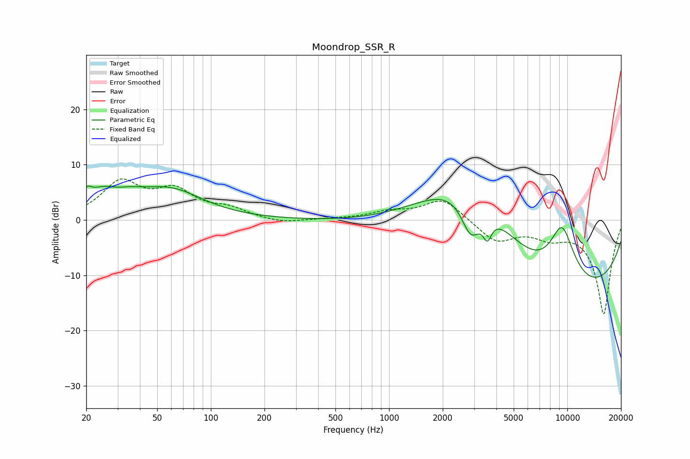

# Moondrop_SSR_R
See [usage instructions](https://github.com/jaakkopasanen/AutoEq#usage) for more options and info.

### Parametric EQs
Apply preamp of -6.2 dB when using parametric equalizer.

|   # | Type    |   Fc (Hz) |    Q |   Gain (dB) |
|-----|---------|-----------|------|-------------|
|   1 | Peaking |        20 | 5.89 |         1.6 |
|   2 | Peaking |        27 | 1.11 |         5.7 |
|   3 | Peaking |        29 | 2.31 |        -1.6 |
|   4 | Peaking |        60 | 0.77 |         4.7 |
|   5 | Peaking |      2871 | 2.39 |        -7.8 |
|   6 | Peaking |      2890 | 0.57 |         9.6 |
|   7 | Peaking |      2970 | 0.38 |        10.1 |
|   8 | Peaking |      3558 | 5.94 |        -3.6 |
|   9 | Peaking |      7218 | 0.21 |       -20   |
|  10 | Peaking |      9331 | 1.56 |        11.8 |

### Fixed Band EQs
When using fixed band (also called graphic) equalizer, apply preamp of **-7.5 dB** (if available) and set gains manually with these parameters.

|   # | Type    |   Fc (Hz) |    Q |   Gain (dB) |
|-----|---------|-----------|------|-------------|
|   1 | Peaking |        31 | 1.41 |         6.5 |
|   2 | Peaking |        62 | 1.41 |         4.7 |
|   3 | Peaking |       125 | 1.41 |         1.7 |
|   4 | Peaking |       250 | 1.41 |        -0.7 |
|   5 | Peaking |       500 | 1.41 |         0.1 |
|   6 | Peaking |      1000 | 1.41 |         1.3 |
|   7 | Peaking |      2000 | 1.41 |         3.9 |
|   8 | Peaking |      4000 | 1.41 |        -3.9 |
|   9 | Peaking |      8000 | 1.41 |        -2.4 |
|  10 | Peaking |     16000 | 1.41 |       -17   |

### Graphs

