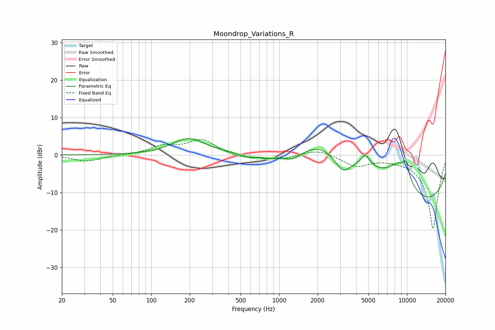

# Moondrop_Variations_R
See [usage instructions](https://github.com/jaakkopasanen/AutoEq#usage) for more options and info.

### Parametric EQs
Apply preamp of -4.5 dB when using parametric equalizer.

|   # | Type    |   Fc (Hz) |    Q |   Gain (dB) |
|-----|---------|-----------|------|-------------|
|   1 | Peaking |       196 | 1.12 |         4.2 |
|   2 | Peaking |       690 | 4.23 |         0.8 |
|   3 | Peaking |       705 | 1.13 |        -3.8 |
|   4 | Peaking |      1276 | 1.58 |        -3.7 |
|   5 | Peaking |      2828 | 0.34 |        11.6 |
|   6 | Peaking |      3151 | 1.97 |        -5.9 |
|   7 | Peaking |      4730 | 4.57 |         2.9 |
|   8 | Peaking |      8762 | 1.39 |         7.3 |
|   9 | Peaking |      9821 | 5.61 |         3.4 |
|  10 | Peaking |     10000 | 0.21 |       -15.5 |

### Fixed Band EQs
When using fixed band (also called graphic) equalizer, apply preamp of **-4.3 dB** (if available) and set gains manually with these parameters.

|   # | Type    |   Fc (Hz) |    Q |   Gain (dB) |
|-----|---------|-----------|------|-------------|
|   1 | Peaking |        31 | 1.41 |        -1.7 |
|   2 | Peaking |        62 | 1.41 |        -0.1 |
|   3 | Peaking |       125 | 1.41 |         2.2 |
|   4 | Peaking |       250 | 1.41 |         4   |
|   5 | Peaking |       500 | 1.41 |        -0.9 |
|   6 | Peaking |      1000 | 1.41 |        -1.2 |
|   7 | Peaking |      2000 | 1.41 |         1.6 |
|   8 | Peaking |      4000 | 1.41 |        -2.8 |
|   9 | Peaking |      8000 | 1.41 |        -0.5 |
|  10 | Peaking |     16000 | 1.41 |       -19.8 |

### Graphs

