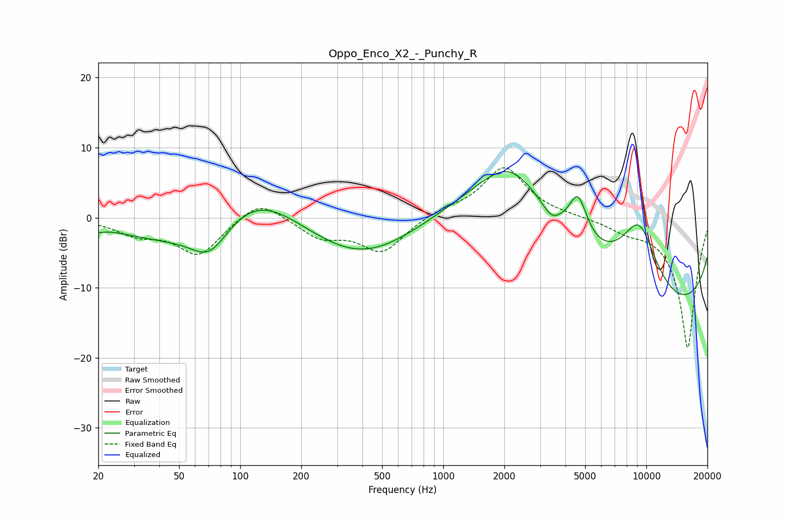

# Oppo_Enco_X2_-_Punchy_R
See [usage instructions](https://github.com/jaakkopasanen/AutoEq#usage) for more options and info.

### Parametric EQs
Apply preamp of -6.7 dB when using parametric equalizer.

|   # | Type    |   Fc (Hz) |    Q |   Gain (dB) |
|-----|---------|-----------|------|-------------|
|   1 | Peaking |        20 | 5.17 |        -0.5 |
|   2 | Peaking |        43 | 0.58 |        -3.1 |
|   3 | Peaking |        71 | 1.4  |        -5.5 |
|   4 | Peaking |       117 | 0.63 |         5.7 |
|   5 | Peaking |       398 | 0.49 |        -6.7 |
|   6 | Peaking |      2147 | 0.57 |        14.9 |
|   7 | Peaking |      3398 | 3.51 |        -1.5 |
|   8 | Peaking |      4610 | 3.11 |         6.2 |
|   9 | Peaking |      9213 | 0.94 |        15.8 |
|  10 | Peaking |      9738 | 0.22 |       -19.5 |

### Fixed Band EQs
When using fixed band (also called graphic) equalizer, apply preamp of **-7.2 dB** (if available) and set gains manually with these parameters.

|   # | Type    |   Fc (Hz) |    Q |   Gain (dB) |
|-----|---------|-----------|------|-------------|
|   1 | Peaking |        31 | 1.41 |        -2.1 |
|   2 | Peaking |        62 | 1.41 |        -5.2 |
|   3 | Peaking |       125 | 1.41 |         3   |
|   4 | Peaking |       250 | 1.41 |        -2.7 |
|   5 | Peaking |       500 | 1.41 |        -4.8 |
|   6 | Peaking |      1000 | 1.41 |         0.9 |
|   7 | Peaking |      2000 | 1.41 |         7.2 |
|   8 | Peaking |      4000 | 1.41 |         0.2 |
|   9 | Peaking |      8000 | 1.41 |        -1.3 |
|  10 | Peaking |     16000 | 1.41 |       -18.7 |

### Graphs

