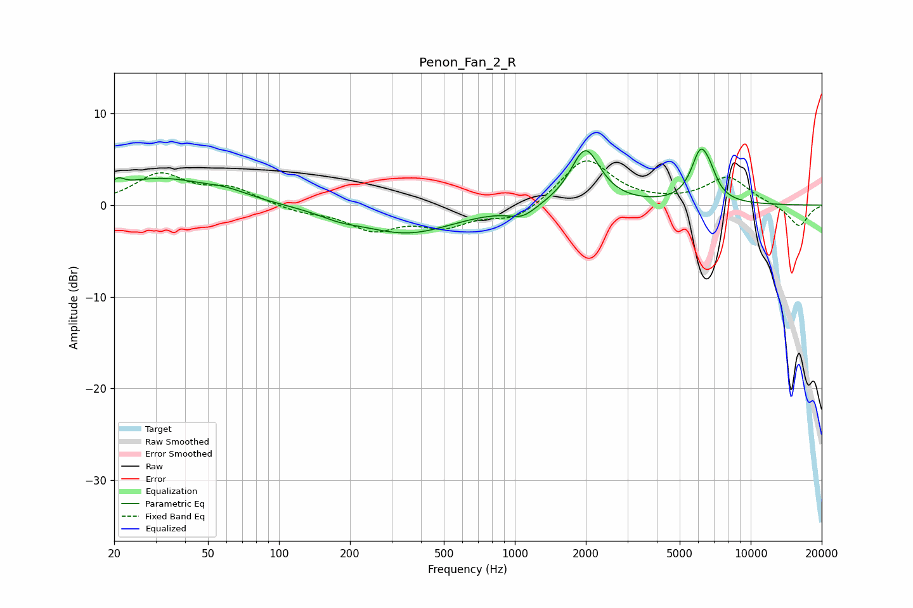

# Penon_Fan_2_R
See [usage instructions](https://github.com/jaakkopasanen/AutoEq#usage) for more options and info.

### Parametric EQs
Apply preamp of -6.2 dB when using parametric equalizer.

|   # | Type    |   Fc (Hz) |    Q |   Gain (dB) |
|-----|---------|-----------|------|-------------|
|   1 | Peaking |        21 | 5.99 |        -2.1 |
|   2 | Peaking |        21 | 5.95 |         2.9 |
|   3 | Peaking |        31 | 0.67 |         2.8 |
|   4 | Peaking |        60 | 1.48 |         0.7 |
|   5 | Peaking |       180 | 1.64 |        -0.6 |
|   6 | Peaking |       349 | 0.7  |        -3   |
|   7 | Peaking |      1078 | 2.44 |        -1.2 |
|   8 | Peaking |      1990 | 2.27 |         6.2 |
|   9 | Peaking |      6125 | 3.44 |         5.3 |
|  10 | Peaking |      6739 | 4.4  |         1.3 |

### Fixed Band EQs
When using fixed band (also called graphic) equalizer, apply preamp of **-4.9 dB** (if available) and set gains manually with these parameters.

|   # | Type    |   Fc (Hz) |    Q |   Gain (dB) |
|-----|---------|-----------|------|-------------|
|   1 | Peaking |        31 | 1.41 |         3.3 |
|   2 | Peaking |        62 | 1.41 |         1.7 |
|   3 | Peaking |       125 | 1.41 |        -0.7 |
|   4 | Peaking |       250 | 1.41 |        -2.5 |
|   5 | Peaking |       500 | 1.41 |        -2   |
|   6 | Peaking |      1000 | 1.41 |        -1.7 |
|   7 | Peaking |      2000 | 1.41 |         5.1 |
|   8 | Peaking |      4000 | 1.41 |         0.1 |
|   9 | Peaking |      8000 | 1.41 |         3   |
|  10 | Peaking |     16000 | 1.41 |        -2.4 |

### Graphs

